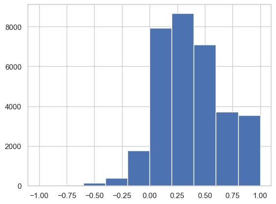

# amazon_products_sentiment_analysis
Sentiment analysis of amazon products and products recommendation

## Project Summary


## Table of Contents
- [ETL](#ETL)
  - [Data Source](#data-source)
  - [Data Sets](#data-sets)
  - [Data Cleaning](#data-cleaning)
  - [Data Loading](#data-loading)
  - [Data Segregation](#data-segregation)
  - [Data Processing](#data-processing)
  - [Data Prediction](#data-prediction)
- [Sentiment Analysis](#sentiment-analysis)
- [Statitical Analysis](#statitical-analysis)
- [Models Comparison](#models-comparison) 
- [Results and Conclusions](#results-and-conclusions)
- [Dependencies](#dependencies)
- [Future Work](#future-work)
- [Acknowledgments](#acknowledgments)
- [Author](#author)
- [References](#references)

# ETL
## Data Source
In this project data is obtained from Home credit default risk at Kaggle.com 
## Data Sets

## Data Cleaning

## Data Loading


``` bash

```


``` bash

```
## Data Segregation

``` bash

```
## Data Processing


``` bash

```

``` bash


```

## Data Prediction  


```

```

# Sentiment Analysis  
Below is code for carrying out sentiment analysis using TextBlob to score the reviews and then bin into three cateogries e.g negative, neutral and positive.
``` bash
# Create a new column 'sentiment' to store the sentiment scores
df_filled_unsupervised['sentiment'] = df_filled_unsupervised['reviews.text'].apply(lambda text: TextBlob(text).sentiment.polarity)

# Convert the continuous sentiment scores to categorical labels (e.g., positive, neutral, negative)
df_filled_unsupervised['sentiment_label'] = pd.cut(df_filled_unsupervised['sentiment'], bins=3, labels=['negative', 'neutral', 'positive'])

# Display the DataFrame with sentiment scores and labels
print(df_filled_unsupervised[['reviews.text', 'sentiment', 'sentiment_label']])
```
### Top 10 Best Seller Products  


Top 10 Products with Count:
|Sr|                Name                                | Count |
|:-|:--------------------------------------------------:|:-----:|
|1 | AmazonBasics AAA Performance Alkaline Batterie...  | 8343  |
|2 | AmazonBasics AA Performance Alkaline Batteries...  | 3728  |
|3 |Fire HD 8 Tablet with Alexa, 8 HD Display, 16 ...   | 2443  |
|4 | All-New Fire HD 8 Tablet, 8 HD Display, Wi-Fi,...  | 2370  |
|5 | Fire Kids Edition Tablet, 7 Display, Wi-Fi, 16...  | 1986  |
|6 | Fire Kids Edition Tablet, 7 Display, Wi-Fi, 16...  | 1676  |
|7 | Fire Kids Edition Tablet, 7 Display, Wi-Fi, 16...  | 1429  |
|8 | Fire Tablet, 7 Display, Wi-Fi, 16 GB - Include...  | 1395  |
|9 | Fire Tablet with Alexa, 7 Display, 16 GB, Blue...  | 987   |
|10|  All-New Fire HD 8 Tablet with Alexa, 8 HD Disp... | 883   |


### Highest Ratings by Customers  

|Sr.| Ratings | Count  |
|:-:|:-------:|:-----: |
|1  |    5    | 23375  |
|2  |    4    | 6856   |
|3  |    3    | 1403   |
|4  |    1    | 1028   |
|5  |    2    | 670    |


# Statistical Analysis  

| Feature            | Result (values)   |
| :----------------- | :----------------: 
|        count       |   33332.000000    |
|         mean       |   0.364646        |  
|         std        |   0.297416        |
|        min         |  -1.000000        |
|       25%          |   0.150000        |
|        50%         |   0.350000        |
|        75%         |   0.562500        |
|         max        |   1.000000        |           

  

# Products Recommendation  

``` bash
user_review = "I absolutely not loved this product!"
recommended_items = recommend_items(user_review)
print("Recommended Items:")
for item in recommended_items:
    print(item)
```
Recommended products of negative review  

```
Recommended Items:
All-New Fire HD 8 Tablet, 8 HD Display, Wi-Fi, 16 GB - Includes Special Offers, Black
AmazonBasics AAA Performance Alkaline Batteries (36 Count)
All-New Fire HD 8 Tablet, 8" HD Display, Wi-Fi, 16 GB - Includes Special Offers, Magenta
AmazonBasics AAA Performance Alkaline Batteries (36 Count)
Fire Tablet, 7 Display, Wi-Fi, 16 GB - Includes Special Offers, Black
```
Recommended items of postive review  
``` bash
user_review = "I absolutely loved this product!"
recommended_items = recommend_items(user_review)
print("Recommended Items:")
for item in recommended_items:
    print(item)
```

```
Recommended Items:
Fire Tablet, 7 Display, Wi-Fi, 16 GB - Includes Special Offers, Black
Expanding Accordion File Folder Plastic Portable Document Organizer Letter Size
AmazonBasics AA Performance Alkaline Batteries (48 Count) - Packaging May Vary
Brand New Amazon Kindle Fire 16gb 7" Ips Display Tablet Wifi 16 Gb Blue
AmazonBasics AAA Performance Alkaline Batteries (36 Count)

```
# Models Comparison  


## Results and Conclusions

  
## Dependencies

This project involves using various dependences listed below for data cleaning and predictions.

```bash
# import Denpendencies
import numpy as np
import pandas as pd
import os
import matplotlib.pyplot as plt
import seaborn as sns
import time
from sklearn.cluster import KMeans
from sklearn.decomposition import PCA
from sklearn.preprocessing import StandardScaler
from datetime import datetime
from textblob import TextBlob
from sklearn.feature_extraction.text import CountVectorizer
from sklearn.model_selection import train_test_split
from sklearn.naive_bayes import MultinomialNB
from sklearn.metrics import accuracy_score
from sklearn.linear_model import LogisticRegression
from sklearn.svm import SVC
from sklearn.ensemble import RandomForestClassifier, GradientBoostingClassifier
from sklearn.metrics import accuracy_score, classification_report
from sklearn.feature_extraction.text import TfidfVectorizer

```
## Future Work


## Acknowledgments


## Author

Muhammad Kashif 

## References
[1] [Amazon Products data]([(https://www.kaggle.com/datasets/datafiniti/consumer-reviews-of-amazon-products?resource=download])
