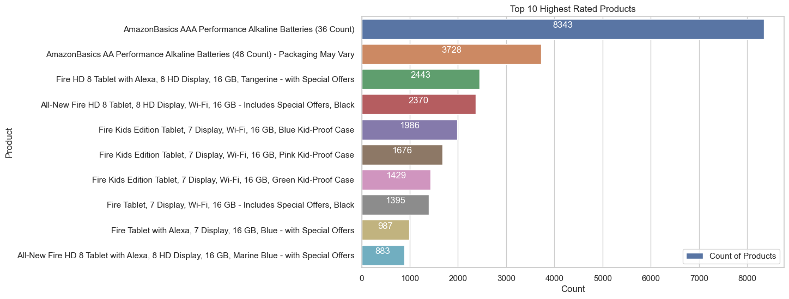
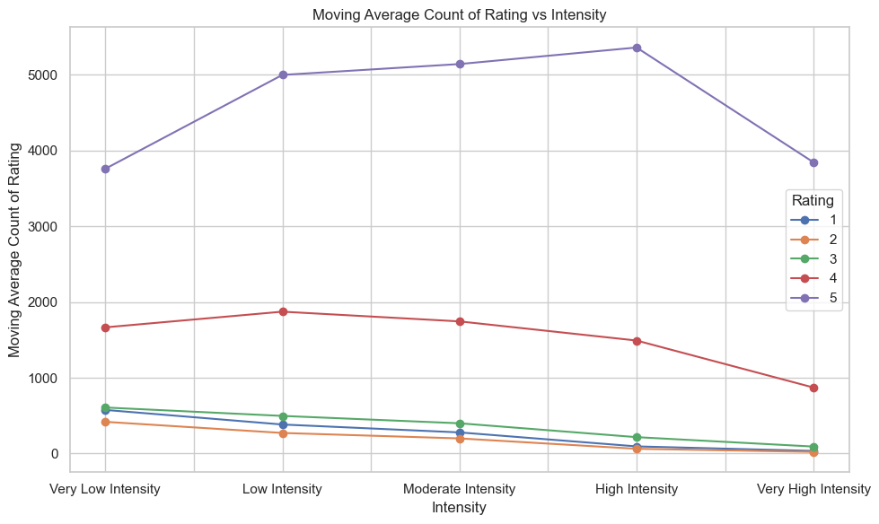

# amazon_products_sentiment_analysis
Sentiment analysis of amazon products and products recommendation

## Project Summary


## Table of Contents
- [ETL](#ETL)
  - [Data Source](#data-source)
  - [Data Sets](#data-sets)
  - [Data Cleaning](#data-cleaning)
  - [Data Loading](#data-loading)
  - [Data Segregation](#data-segregation)
  - [Data Processing](#data-processing)
  - [Data Prediction](#data-prediction)
- [Sentiment Analysis](#sentiment-analysis)
- [Statitical Analysis](#statitical-analysis)
- [Models Comparison](#models-comparison) 
- [Results and Conclusions](#results-and-conclusions)
- [Dependencies](#dependencies)
- [Future Work](#future-work)
- [Acknowledgments](#acknowledgments)
- [Author](#author)
- [References](#references)

# ETL
## Data Source
In this project data is obtained from datafinit consumer reviews of amazon products at Kaggle.com 

## Data Sets
in this project source files were renamed as amazon1.csv and amazon2.csv.

## Data Cleaning
Data cleaning was initiated by cleaning date and time columns(dateAdded, dateUpdated, reviews.date, reviews.dateSeen)  which had both values in one column so date and time was splitted into different columns respectively by adding _date and _time at the of main column name for better clarity. After the splitting, null values were determined and mainly three columns (reviews.dateAdded, reviews.id) showed most null values which were deleted. Then missing values of categorical values are filled using clustering predictive method. Details of this method is available in repository [Home Credit Default Risk Categorical Data Cleaning]([https://github.com/muhkashiff/Extract_transform_load_EDA_Home_credit]) .
## Data Loading


``` bash

```


``` bash

```
## Data Segregation

``` bash

```
## Data Processing


``` bash

```

``` bash


```

## Data Prediction  


```

```

# Sentiment Analysis  
Below is code for carrying out sentiment analysis using TextBlob to score the reviews and then bin into three cateogries e.g negative, neutral and positive.
``` bash
# Create a new column 'sentiment' to store the sentiment scores
df_filled_unsupervised['sentiment'] = df_filled_unsupervised['reviews.text'].apply(lambda text: TextBlob(text).sentiment.polarity)

# Convert the continuous sentiment scores to categorical labels (e.g., positive, neutral, negative)
df_filled_unsupervised['sentiment_label'] = pd.cut(df_filled_unsupervised['sentiment'], bins=3, labels=['negative', 'neutral', 'positive'])

# Display the DataFrame with sentiment scores and labels
print(df_filled_unsupervised[['reviews.text', 'sentiment', 'sentiment_label']])
```
### Top 10 Best Seller Products  
Top 10 Products with Count:
<div align="center">  
  
|Sr|                Name                                | Count |                  
|:-|:--------------------------------------------------:|:-----:|
|1 | AmazonBasics AAA Performance Alkaline Batterie...  | 8343  |
|2 | AmazonBasics AA Performance Alkaline Batteries...  | 3728  |                              
|3 |Fire HD 8 Tablet with Alexa, 8 HD Display, 16 ...   | 2443  |                              
|4 | All-New Fire HD 8 Tablet, 8 HD Display, Wi-Fi,...  | 2370  |                              
|5 | Fire Kids Edition Tablet, 7 Display, Wi-Fi, 16...  | 1986  |                              
|6 | Fire Kids Edition Tablet, 7 Display, Wi-Fi, 16...  | 1676  |                              
|7 | Fire Kids Edition Tablet, 7 Display, Wi-Fi, 16...  | 1429  |                              
|8 | Fire Tablet, 7 Display, Wi-Fi, 16 GB - Include...  | 1395  |                              
|9 | Fire Tablet with Alexa, 7 Display, 16 GB, Blue...  | 987   |                              
|10|  All-New Fire HD 8 Tablet with Alexa, 8 HD Disp... | 883   |                              
</div>  

  


### Highest Ratings by Customers  

Count of products with highest rating are determined.
Overall it is observed that most of the products got                                    

<div align="center">
  <table>
    <tr>
      <td><strong>Ratings Count Visualization</strong></td>
    </tr>
    <tr>
      <td></td>   
    </tr>
  </table>  
</div>  

### Products Recommended by Customers  

<div align="center">
  <table>
    <tr>
      <td><strong>Ratings Count Visualization</strong></td>
    </tr>
    <tr>
      <td></td>   
    </tr>
  </table>  
</div>
## Top Products Classification 

### Product Recommendation Classification  
  

### Product Recommendation Subjectivity Classification  
  


### Product Recommendation Intensity Classification  
 

### Entity Sentiments Classification
  

### Product Recommendation Sentiment Classification  
 


## Data Distribution
<table>
  <tr>
    <td>Pie Chart Emotion</td>
    <td>Pie Chart Intensity</td>
    <td>Pie Chart Sentiment Entity</td>
  </tr>
  <tr>
    <td></td>
    <td></td>
    <td></td>
  </tr>
  <tr>
    <td>Pie Chart Sentiment</td>
    <td>Pie Chart Subjectivity</td>
  </tr>
  <tr>
    <td></td>
    <td></td>
  </tr>
</table>  

## Moving Average Plot of Sentiments Vs Recommendation
<table>
  <tr>
    <td>Recommendations Vs Emotion</td>
    <td>Recommendations Vs Subjectivity</td>
  </tr>
  <tr>
    <td></td>
    <td></td>
    
  </tr>
  <tr>
    <td>Recommendations Vs Sentiment</td>
    <td>Recommendations Vs Intensity</td>
  </tr>
  <tr>
    <td></td>
    <td></td>
  </tr>
</table>  

## Moving Average Plot of Sentiments Vs Rating
<table>
  <tr>
    <td>Rating Vs Emotion</td>
    <td>Rating Vs Subjectivity</td>
  </tr>
  <tr>
    <td></td>
    <td></td>
    
  </tr>
  <tr>
    <td>Rating Vs Sentiment</td>
    <td>Rating Vs Intensity</td>
  </tr>
  <tr>
    <td></td>
    <td></td>
  </tr>
</table> 

## Ratings Vs Sentiment features Heatmaps
<table>
  <tr>
    <td>Rating Vs Emotion</td>
    <td>Rating Vs Subjectivity</td>
  </tr>
  <tr>
    <td></td>
    <td></td>
    
  </tr>
  <tr>
    <td>Rating Vs Sentiment</td>
    <td>Rating Vs Intensity</td>
  </tr>
  <tr>
    <td></td>
    <td></td>
  </tr>
</table>  

## Recommendation Vs Sentiment features Heatmaps
<table>
  <tr>
    <td>Recommendations Vs Emotion</td>
    <td>Recommendations Vs Subjectivity</td>
  </tr>
  <tr>
    <td></td>
    <td></td>
    
  </tr>
  <tr>
    <td>Recommendations Vs Sentiment</td>
    <td>Recommendations Vs Intensity</td>
  </tr>
  <tr>
    <td></td>
    <td></td>
  </tr>
</table>  

## Correlation Analysis
<table>
  <tr>
    <td>Correlation Sentiment Vs Intensity</td>
    <td>Correlation Sentiment Vs Subjectivity</td>
    <td>Correlation Subjectivity Vs Intensity</td>
  </tr>
  <tr>
    <td></td>
    <td></td>
    <td></td>
  </tr>
</table>

## Time Series Analysis


### Sentiment counts


# Statistical Analysis  
<div align="center">  
  
| Feature            | Result (values)   |
| :----------------- | :----------------: 
|        count       |   33332.000000    |
|         mean       |   0.364646        |  
|         std        |   0.297416        |
|        min         |  -1.000000        |
|       25%          |   0.150000        |
|        50%         |   0.350000        |
|        75%         |   0.562500        |
|         max        |   1.000000        |           

</div>  

## Histogram
  


## Scatter Plot


## Outliers analysis
<table>
  <tr>
    <td>Sentiments Score Outliers</td>
    <td>Intensity Score Outliers</td>
    <td>Subjectivity Score Outliers</td>
  </tr>
  <tr>
    <td></td>
    <td></td>
    <td></td>
  </tr>
</table>

# Products Recommendation  

``` bash
user_review = "I absolutely not loved this product!"
recommended_items = recommend_items(user_review)
print("Recommended Items:")
for item in recommended_items:
    print(item)
```
Recommended products of negative review  

```
Recommended Items:
All-New Fire HD 8 Tablet, 8 HD Display, Wi-Fi, 16 GB - Includes Special Offers, Black
AmazonBasics AAA Performance Alkaline Batteries (36 Count)
All-New Fire HD 8 Tablet, 8" HD Display, Wi-Fi, 16 GB - Includes Special Offers, Magenta
AmazonBasics AAA Performance Alkaline Batteries (36 Count)
Fire Tablet, 7 Display, Wi-Fi, 16 GB - Includes Special Offers, Black
```
Recommended items of postive review  
``` bash
user_review = "I absolutely loved this product!"
recommended_items = recommend_items(user_review)
print("Recommended Items:")
for item in recommended_items:
    print(item)
```

```
Recommended Items:
Fire Tablet, 7 Display, Wi-Fi, 16 GB - Includes Special Offers, Black
Expanding Accordion File Folder Plastic Portable Document Organizer Letter Size
AmazonBasics AA Performance Alkaline Batteries (48 Count) - Packaging May Vary
Brand New Amazon Kindle Fire 16gb 7" Ips Display Tablet Wifi 16 Gb Blue
AmazonBasics AAA Performance Alkaline Batteries (36 Count)

```
# Models Comparison  

## Classification Reports Comparison

### Naive Bayes Classification Reports  
<table>
  <tr>
    <td>Tfidf Vectoriztaion Naive Bayes</td>
    <td>Count Vectorization Naive Bayes</td>
  </tr>
  <tr>
    <td></td>
    <td></td>    
  </tr>
</table>  

### Gradient Boost Classification Reports  
<table>
  <tr>
    <td>Tfidf Vectoriztaion Gradient Boost</td>
    <td>Count Vectorization Gradient Boost</td>
  </tr>
  <tr>
    <td></td>
    <td></td>    
  </tr>
</table>  

### Random Forest Classification Reports  
<table>
  <tr>
    <td>Tfidf Vectoriztaion Random Forest</td>
    <td>Count Vectorization Random Forest</td>
  </tr>
  <tr>
    <td></td>
    <td></td>    
  </tr>
</table>  

### SVM Classification Reports  
<table>
  <tr>
    <td>Tfidf Vectoriztaion SVM</td>
    <td>Count Vectorization SVM</td>
  </tr>
  <tr>
    <td></td>
    <td></td>    
  </tr>
</table>  

### Logistic Regression Classification Reports  
<table>
  <tr>
    <td>Tfidf Vectoriztaion Logistic Regression</td>
    <td>Count Vectorization Logistic Regression</td>
  </tr>
  <tr>
    <td></td>
    <td></td>    
  </tr>
</table> 


## Models Precision Comparison
<table>
  <tr>
    <td>Tfidf Vectoriztaion Precision</td>
    <td>Count Vectorization Precision</td>
  </tr>
  <tr>
    <td></td>
    <td></td>    
  </tr>
</table>  

## Models F1 Score Comparison
<table>
  <tr>
    <td>Tfidf Vectoriztaion F1 Score</td>
    <td>Count Vectorization F1 Score</td>
  </tr>
  <tr>
    <td></td>
    <td></td>    
  </tr>
</table>  

## Models Recall Score Comparison
<table>
  <tr>
    <td>Tfidf Vectoriztaion Recall Score</td>
    <td>Count Vectorization Recall Score</td>
  </tr>
  <tr>
    <td></td>
    <td></td>    
  </tr>
</table>


## Models Accuracy Comparison


## Results and Conclusions

  
## Dependencies

This project involves using various dependences listed below for data cleaning and predictions.

```bash
# import Denpendencies
import numpy as np
import pandas as pd
import os
import matplotlib.pyplot as plt
import seaborn as sns
import time
from sklearn.cluster import KMeans
from sklearn.decomposition import PCA
from sklearn.preprocessing import StandardScaler
from datetime import datetime
from textblob import TextBlob
from sklearn.feature_extraction.text import CountVectorizer
from sklearn.model_selection import train_test_split
from sklearn.naive_bayes import MultinomialNB
from sklearn.metrics import accuracy_score
from sklearn.linear_model import LogisticRegression
from sklearn.svm import SVC
from sklearn.ensemble import RandomForestClassifier, GradientBoostingClassifier
from sklearn.metrics import accuracy_score, classification_report
from sklearn.feature_extraction.text import TfidfVectorizer
import nltk
import spacy

```
## Future Work


## Acknowledgments


## Author

Muhammad Kashif 

## References
[1] [Amazon Products data]([https://www.kaggle.com/datasets/datafiniti/consumer-reviews-of-amazon-products?resource=download])
