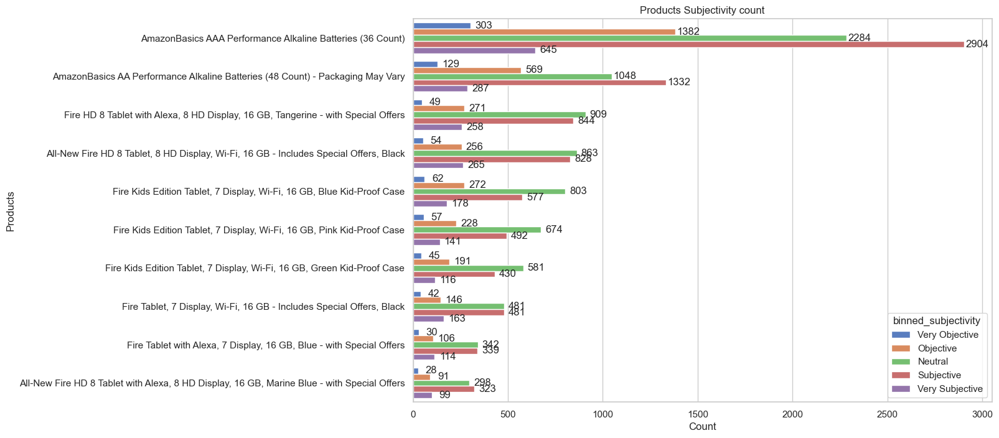
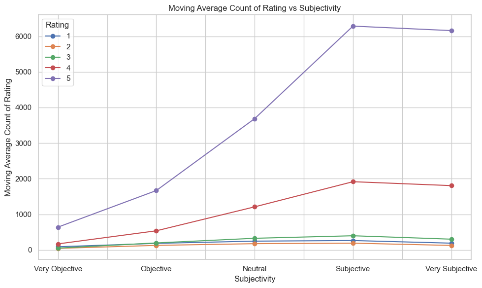

# amazon_products_sentiment_analysis
Sentiment analysis of amazon products and products recommendation

## Project Summary
Our project delves into the intricate world of product reviews, addressing fundamental questions that both consumers and sellers grapple with daily. We embark on a journey to uncover the essence of customer sentiment, probing into the depths of each review to discern its true nature. From quantifying the volume of reviews to deciphering their emotional tone—whether positive, negative, or neutral—we leave no stone unturned. But our pursuit goes beyond mere analysis; we strive to differentiate between genuine feedback and deceptive reviews, employing cutting-edge techniques to detect authenticity. Moreover, we don the hat of a seller, offering insightful suggestions on how to respond to positive or negative feedback to optimize customer satisfaction and drive business growth. Our project is a beacon of insight, illuminating the path to informed decision-making for both consumers and sellers alike. 

## Table of Contents

- [Data Source](#data-source)
- [Data Sets](#data-sets)
- [Data Cleaning](#data-cleaning)
- [Sentiment Analysis](#sentiment-analysis)  
  - [Determining Sentiment](#determining-sentiment)   
  - [Determining Subjectivity](#determining-subjectivity)  
  - [Determining Emotion](#determining-emotion)  
  - [Determining Intensity](#determining-intensity)
  - [Determining Entities Sentiment](#determining-entities-sentiment)  
- [Amazon Products Analysis](#amazon-products-analysis)
  - [Top 10 Reviewed Products](#top-10-reviewed-products)
  - [Highest Rated Products](#highest-rated-products)
  - [Most Recommended Products](#most-recommended-products)
- [Amazon Products Sentiment Analysis](#amazon-products-sentiment-analysis)
  - [Sentiments Data Distribution](#sentiments-data-distribution)
  - [Unlocking Consumer Sentiment: Comprehensive Analysis of Product-Based Sentiment Scores](#unlocking-consumer-sentiment-comprehensive-analysis-of-product-based-sentiment-scores)
    - [Products Sentiments Score](#products-sentiments-score)   
    - [Products Subjectivity Score](#products-subjectivity-score)
    - [Products Emotion Score](#products-emotion-score)    
    - [Products Intensity Score](#products-intensity-score)  
    - [Products Entity Sentiments Score](#products-entity-sentiments-score)  
    - [Products All Sentiments Aggregated Visualization](#products-all-sentiments-aggregated-visualization)
  - [Categories Sentiment Score](#categories-sentiment-score)
- [Temporal Analysis](#temporal-analysis)
  - [Reviewed Products Count](#reviewed-products-count)
  - [Reviewed Products Sentiments Count](#reviewed-products-sentiments-count)
- [Entities Analysis](#entities-analysis)
  - [Entities Count](#entities-count)
  - [Entities Word Cloud](#entities-word-cloud)  
- [Accessing Reviews Authenticity](#accessing-reviews-authenticity)
  - [Moving Average Plots Analysis](#moving-average-plots-analysis)
  - [Heatmaps Analysis](#heatmaps-analysis)
  - [Correlation Analysis](#correlation-analysis)  
- [Statistical Analysis](#statistical-analysis)
  - [Summary Statistics](#summary-statistics)
  - [Histograms](#histograms)
  - [Box whisker Plots](#box-whisker-plots)
  - [Scatter Plot](#scatter-plot)
  - [Hypothesis Testing](#hypothesis-testing)
- [Models Comparison](#models-comparison)
   - [Classification Reports](#classification-reports)
   - [Parameters Heatmaps Comparison](#parameters-heatmaps-comparison)
   - [Models Accuracy Comparison](#models-accuracy-comparison)
- [Products Recommendations Using Machine Learning](#products-recommendations-using-machine-learning)
- [Results and Conclusions](#results-and-conclusions)
- [Dependencies](#dependencies)
- [Future Work](#future-work)
- [Acknowledgments](#acknowledgments)
- [Author](#author)
- [References](#references)

## Data Source
In this project data is obtained from datafinit consumer reviews of amazon products at Kaggle.com 

## Data Sets
in this project source files were renamed as amazon1.csv and amazon2.csv.

## Data Cleaning
Data cleaning was initiated by cleaning date and time columns(dateAdded, dateUpdated, reviews.date, reviews.dateSeen)  which had both values in one column so date and time was splitted into different columns respectively by adding _date and _time at the of main column name for better clarity. After the splitting, null values were determined and mainly three columns (reviews.dateAdded, reviews.id) showed most null values which were deleted. Then missing values of categorical values are filled using clustering predictive method. Details of this method is available in repository [Home Credit Default Risk Categorical Data Cleaning](https://github.com/muhkashiff/Extract_transform_load_EDA_Home_credit) . Cleaned data is then used for performing sentiment analysis.

# Sentiment Analysis  
Sentiment analysis, also known as opinion mining, is a natural language processing (NLP) technique used to determine the sentiment or emotional tone expressed in a piece of text. The goal of sentiment analysis is to automatically identify and extract subjective information, such as opinions, attitudes, emotions, and feelings, from textual data.  

Sentiment analysis can classify text into different categories, such as positive, negative, or neutral, based on the underlying sentiment conveyed by the words and phrases used in the text. It can be applied to various types of textual data, including product reviews, social media posts, customer feedback, news articles, and more. For the sake of project, amazon customer reviews and tested to determine the sentiments.  
In this project reviews were analysed by using below methods to determine type and credibility of the reviews.  
1. Determing Sentiment   
2. Determing Subjectivity  
3. Determing Emotion  
4. Determining Intensity  
5. Determining Sentiment Entity

## Determining Sentiment  
Sentiment score is determined and based on score positive , negative, and neutral label are generated in sentiment_label column.  
Below is code for carrying out sentiment analysis using TextBlob to score the reviews and then bin into three cateogries e.g negative, neutral and positive.
``` bash
# Create a new column 'sentiment' to store the sentiment scores
df_filled_unsupervised['sentiment'] = df_filled_unsupervised['reviews.text'].apply(lambda text: TextBlob(text).sentiment.polarity)

# Convert the continuous sentiment scores to categorical labels (e.g., positive, neutral, negative)
df_filled_unsupervised['sentiment_label'] = pd.cut(df_filled_unsupervised['sentiment'], bins=3, labels=['negative', 'neutral', 'positive'])

# Display the DataFrame with sentiment scores and labels
print(df_filled_unsupervised[['reviews.text', 'sentiment', 'sentiment_label']])
```
## Determining Subjectivity  
In the subjectivity, it is determined if the reviews are subjective or objective. Although for better classification reviews are binned into five categories (Very Objective, Objective, Neutral, Subjective, Very Subjective). Subjectivity score and Label are stored in different columns. code for determining subjectivity is below.  
``` bash
# Function to calculate subjectivity score
def calculate_subjectivity(text):
    blob = TextBlob(text)
    return blob.sentiment.subjectivity

# Apply function to 'reviews.text' column and store results in new column 'subjectivity_score'
sentiment_df['subjectivity_score'] = sentiment_df['reviews.text'].apply(calculate_subjectivity)
# Define bins
bins = [0, 0.2, 0.4, 0.6, 0.8, 1.0]  

# Create labels for bins
labels = ['Very Objective', 'Objective', 'Neutral', 'Subjective', 'Very Subjective']

# Bin the subjectivity scores and create a new column 'binned_subjectivity'
sentiment_df['binned_subjectivity'] = pd.cut(sentiment_df['subjectivity_score'], bins=bins, labels=labels)

# Display DataFrame with new column
print(sentiment_df)  
```
## Determining Emotion  
Emotion is determined and stored into four categories joy, Sadness, Anger, Neutral. below is code snippet.  
``` bash
# Function to perform emotion analysis and categorize into bins
def analyze_emotion(text):
    # Analyze sentiment using TextBlob
    blob = TextBlob(text)
    # Get sentiment polarity
    polarity = blob.sentiment.polarity

    # Categorize into bins based on polarity
    if polarity > 0.3:
        return 'Joy'
    elif polarity < -0.3:
        return 'Sadness'
    elif polarity < 0:
        return 'Anger'
    else:
        return 'Neutral'

# Apply emotion analysis function to 'reviews.text' column and store results in new column 'emotion'
sentiment_df['emotion'] = sentiment_df['reviews.text'].apply(analyze_emotion)

# Display DataFrame with new column
print(sentiment_df)
```
## Determining Intensity  

Intensity is determined using sentiment polarity score and then scores are binned into five categories;  
1. Very Low Intensity
2. Low Intensity
3. Moderate Intensity
4. High Intensity
5. Very high Intensity
``` bash
# Function to perform intensity analysis
def analyze_intensity(text):
    # Analyze sentiment using TextBlob
    blob = TextBlob(text)
    # Get sentiment polarity
    polarity = blob.sentiment.polarity

    # Calculate intensity as the absolute value of polarity
    intensity = abs(polarity)

    return intensity

# Apply intensity analysis function to 'reviews.text' column and store results in new column 'intensity'
sentiment_df['intensity'] = sentiment_df['reviews.text'].apply(analyze_intensity)
# Define bins
bins = [0, 0.2, 0.4, 0.6, 0.8, 1.0]  

# Create labels for bins
labels = ['Very Low Intensity', 'Low Intensity', 'Moderate Intensity', 'High Intensity', 'Very High Intensity']

# Bin the intensity scores and create a new column 'binned_intensity'
sentiment_df['intensity_level'] = pd.cut(sentiment_df['intensity'], bins=bins, labels=labels)

# Display DataFrame with new column
print(sentiment_df)
``` 

##  Determining Entities Sentiment 

Entities sentiment score and key words are determined. For sake of project only keywords with highest score are kept. Since the focus of project is to determine polarity of the reviews.  
``` bash
# Load SpaCy's English language model
nlp = spacy.load("en_core_web_sm")

# Function to perform entity sentiment analysis
def analyze_entity_sentiment(text):
    # Process the text with SpaCy
    doc = nlp(text)

    # Initialize variables to store the entity with the highest sentiment score
    highest_entity = None
    highest_score = float('-inf')  # Initialize with negative infinity

    # Iterate over each named entity in the text
    for ent in doc.ents:
        # Analyze sentiment using TextBlob or any other sentiment analysis tool
        sentiment_score = TextBlob(ent.text).sentiment.polarity
        # Check if the entity and sentiment score are not None
        if ent.text and sentiment_score is not None:
            # Check if the current entity has a higher sentiment score than the previous highest
            if abs(sentiment_score) > highest_score:
                highest_entity = ent.text
                highest_score = abs(sentiment_score)

    # Return the entity with the highest sentiment score
    return highest_entity

# Function to perform binning based on sentiment score
def bin_sentiment(score):
    if score > 0.3:
        return 'Positive'
    elif score < -0.3:
        return 'Negative'
    else:
        return 'Neutral'

# Apply entity sentiment analysis function to each row of the DataFrame
sentiment_df['highest_sentiment_entity'] = sentiment_df['reviews.text'].apply(analyze_entity_sentiment)

# Apply binning to sentiment scores of entities
sentiment_df['entity_sentiment_level'] = sentiment_df['highest_sentiment_entity'].apply(lambda x: bin_sentiment(TextBlob(x).sentiment.polarity) if x else None)

```
## Amazon Products Analysis
In this analysis products that got most reviews and type of reviews are analysed.  

### Top 10 Reviewed Products  
Top 10 reviewed products are below in the table along with number of reviews each product got :
<div align="center">  
  
|Sr|                Name                                | Count |                  
|:-|:--------------------------------------------------:|:-----:|
|1 | AmazonBasics AAA Performance Alkaline Batterie...  | 8343  |
|2 | AmazonBasics AA Performance Alkaline Batteries...  | 3728  |                              
|3 |Fire HD 8 Tablet with Alexa, 8 HD Display, 16 ...   | 2443  |                              
|4 | All-New Fire HD 8 Tablet, 8 HD Display, Wi-Fi,...  | 2370  |                              
|5 | Fire Kids Edition Tablet, 7 Display, Wi-Fi, 16...  | 1986  |                              
|6 | Fire Kids Edition Tablet, 7 Display, Wi-Fi, 16...  | 1676  |                              
|7 | Fire Kids Edition Tablet, 7 Display, Wi-Fi, 16...  | 1429  |                              
|8 | Fire Tablet, 7 Display, Wi-Fi, 16 GB - Include...  | 1395  |                              
|9 | Fire Tablet with Alexa, 7 Display, 16 GB, Blue...  | 987   |                              
|10|  All-New Fire HD 8 Tablet with Alexa, 8 HD Disp... | 883   |                              
</div>  

### Highest Rated Products 

Ratings count visualization shows that most of the products got top ratings of 5 and 4. top 10 highest rated products visualization shows products with most ratings. 

<div align="center">
  <table>
    <tr>
      <td><strong>Ratings Count Visualization</strong></td>
    </tr>
    <tr>
      <td></td>   
    </tr>
  </table>  
</div>  

  

### Most Recommended Products 
Recommendation count visualization shows 31199 products are recommended by customers and 2133 products are not recommended by customers. Recommended products make 93% of total prodcuts reviewed and only 7% products got no recommendation.
<div align="center">
  <table>
    <tr>
      <td><strong>Recommendation Count Visualization</strong></td>
    </tr>
    <tr>
      <td></td>   
    </tr>
  </table>  
</div>  
Amazon products with recommendation are shown below.

  

## Amazon Products Sentiment Analysis 
Sentiment analysis of consumer reviews on Amazon products is conducted through a variety of methods outlined below:

### Sentiments Data Distribution  

This GitHub repository employs sophisticated algorithms to dissect sentiments within Amazon product reviews. The results are elegantly visualized through pie charts, offering a comprehensive overview. A striking revelation surfaces: a staggering 99% of sentiments lean towards positivity or neutrality, while a mere 0.8% veer towards negativity. Yet, the analysis delves deeper, spotlighting the intensity of these sentiments. Notably, 29.2% emanate from extreme intensities, prompting scrutiny for potential falsification. This observation fuels our investigation, augmented by rigorous statistical hypothesis testing.

Further exploration into emotional tones reveals a compelling narrative. An overwhelming 92.9% of reviews exude joy and neutrality, contrasting starkly with a minimal 7.1% expressing anger and sadness, underscoring Amazon's adeptness at evoking positive consumer responses. Subjectivity dominates in 82.6% of reviews, juxtaposed with a more objective 17.4%, delineating a nuanced interplay between personal perspectives and objectivity. This interplay hints at the potential correlation between subjectivity and positive emotions, contrasting with the potential negativity associated with objectivity.

Moreover, entity analysis unveils a notable 97.5% neutrality, with a marginal 2.5% exuding positivity, implying a prevailing authenticity in consumer feedback. In summary, these pie charts serve as a testament not only to the favorable consumer sentiment towards Amazon products but also to the nuanced interplay between subjective experiences and objective assessments, thereby enriching our understanding of consumer perspectives.  


<table>
  <tr>
    <td>Pie Chart Emotion</td>
    <td>Pie Chart Intensity</td>
    <td>Pie Chart Sentiment Entity</td>
  </tr>
  <tr>
    <td></td>
    <td></td>
    <td></td>
  </tr>
  <tr>
    <td>Pie Chart Sentiment</td>
    <td>Pie Chart Subjectivity</td>
  </tr>
  <tr>
    <td></td>
    <td></td>
  </tr>
</table>  

## Unlocking Consumer Sentiment: Comprehensive Analysis of Product-Based Sentiment Scores  

In this exploration, we delve into the intricate world of consumer sentiments surrounding various products. Through meticulous analysis, we unravel the layers of emotions and opinions expressed by consumers in their reviews. Our goal is to provide a deep understanding of how products resonate with consumers, from eliciting joy and satisfaction to addressing concerns and disappointments. It has been tried to navigate through the rich tapestry of sentiments, offering valuable insights into consumer perceptions and preferences.

### Products Sentiments Score  
In Amazon consumer reviews, sentiments reflect how customers feel about products or services, divided into positive, negative, or neutral categories. Positive sentiments express satisfaction and approval, often using words like "love," "excellent," or "amazing" to highlight product strengths and benefits. Conversely, negative sentiments convey dissatisfaction or criticism, with phrases like "hate" or "poor quality" pointing out flaws or issues. Neutral sentiments express a balanced stance, neither strongly praising nor criticizing the product. For instance, phrases like "okay" or "average" suggest a lack of strong emotional attachment. A chart visualizing sentiments of top 10 products reveals that Alkaline AAA and AA batteries received the most reviews. Among them, Alkaline AAA batteries showed overwhelmingly positive and neutral sentiments, with only a tiny percentage of negative feedback. This trend suggests that Amazon products, especially batteries, are generally well-received by customers. For example, Alkaline AAA batteries received 48.84% positive sentiment, 49.97% neutral sentiment, and only 1.18% negative sentiment out of a total of 8343 sentiments.  


###  Products Subjectivity Score 
Amazon reviews serve as a rich tapestry of opinions, experiences, and viewpoints from individual customers regarding products or services. Each review encapsulates the unique preferences, biases, and expectations of its author, rendering them inherently subjective. This subjectivity leads to a diverse spectrum of reviews, ranging from highly personal and emotive to more objective assessments. Reviewers often assess products based on subjective criteria, such as usability, aesthetics, durability, value for money, and overall satisfaction, which can vary greatly from person to person. Biases and preconceptions further influence these assessments, stemming from factors like brand loyalty, previous experiences, or external influences. To understand the subjectivity within Amazon reviews, a chart below illustrates the breakdown of subjective versus objective scores for various products. In this analysis, a higher subjective score suggests a greater infusion of personal opinion, implying more authentic reviews driven by consumer sentiment.Since AAA batteries have received the highest number of reviews, we will focus on analyzing the percentage of sentiments for the most reviewed products. Out of 7518 reviews, subjective and very subjective sentiments contribute 3549 (47.21%), neutral sentiments constitute 2284 (30.38%), and objective and very objective sentiments make up 1685 (22.41%). The prevalence of subjective scores suggests a stronger emotional connection from customers in their reviews, indicating authenticity and reflecting personal sentiments towards the products.  

  

### Products Emotion Score  

In Amazon reviews, emotions paint a vivid picture of how customers feel about products and services. Using words like "love," "amazing," and "thrilled," they share their happiness and satisfaction. But when they feel "hate," "frustration," or "disappointment," it shows there's something wrong. Emoticons and emoji add another layer of expression, with smiley faces and hearts showing joy, and sad faces expressing disappointment. These emotions aren't just for show; they influence how people buy. Positive feelings make products seem more desirable, while negative ones make buyers think twice. Looking at a chart for AAA Alkaline batteries, we see most reviews are joyful, with 50.95% expressing happiness and 37.55% feeling neutral. Only a small percentage show anger or sadness, showing most customers are happy. Even a product like the All-New FireHD 8 Tablet with Alexa, despite fewer reviews, has mostly joyful customers. Overall, emotions in Amazon reviews show how deeply people connect with products and can guide businesses to better satisfy their customers. 

 
### Products Intensity Score  
Intensity refers to the strength or depth of emotion expressed by customers regarding a product or service.the actual content of the review text provides insights into the intensity of sentiment. Words and phrases used by reviewers can indicate the depth of their emotions. For example, phrases like "absolutely love," "hate it," "couldn't be happier," or "worst purchase ever" convey varying degrees of intensity.The length and level of detail in a review can also signal the intensity of sentiment. Longer, more detailed reviews often indicate a stronger emotional investment in the product or experience, whether positive or negative. A short review might not provide as much insight into the intensity of sentiment compared to a longer, more elaborate one.Sentiment analysis algorithms can analyze the frequency of specific keywords or phrases associated with positive or negative sentiments. Words with stronger emotional connotations, such as "amazing," "terrible," "fantastic," or "disappointing," can help determine the intensity of sentiment expressed in the reviews.

 

### Products Entity Sentiments Score  
Entities sentiments in Amazon consumer reviews refer to the emotional tone associated with specific entities mentioned within the reviews, such as products, brands, or features.  Entities sentiments often revolve around specific products or brands mentioned in the reviews. Customers express their feelings and experiences regarding these products through positive, negative, or neutral sentiments. Positive sentiments may indicate satisfaction with the product's quality, performance, or value for money, while negative sentiments may highlight dissatisfaction, issues, or shortcomings. Neutral sentiments may indicate a balanced or indifferent stance towards the product.Entities sentiments can also extend to sentiments towards brands or manufacturers. Customers may have positive sentiments towards trusted brands known for quality and reliability, while negative sentiments may arise towards brands associated with poor customer service or product failures. Brand sentiments play a crucial role in shaping consumer perceptions, loyalty, and purchase decisions.In addition to product-related sentiments, customers may also express sentiments towards the services associated with the product, such as shipping, packaging, or customer support. Positive service sentiments may indicate a smooth purchasing experience and excellent customer service, while negative sentiments may highlight issues such as delays, damages, or poor communication. from the chart it is evident that most of the products have neutral entities.

  

### Products All Sentiments Aggregated Visualization
The chart illustrates a comprehensive analysis pipeline, encompassing data aggregation, sorting, filtering, and visualization, aimed at unraveling sentiment-related insights for diverse products within the DataFrame. This methodological approach serves as a powerful lens, uncovering intricate patterns, discernible trends, and noteworthy outliers embedded within the sentiment data. By dissecting the sentiment-related scores across various products, this chart facilitates a nuanced understanding of customer perceptions and sentiments, shedding light on the intricate tapestry of consumer experiences. Notably, the chart unveils intriguing relationships among sentiments, as evidenced by the observation that Line-a corresponds to the Amazon HD 8 Kids Pink waterproof casing product. This product emerges with the highest scores in intensity, objectivity, joy, and positive sentiment, imparting a sense of complexity to the reviews. In contrast, the AAA Alkaline batteries(Line-b), despite amassing a substantial volume of reviews, exhibit distinct sentiment characteristics. With high subjectivity, low intensity, and a prevalence of joy and neutral sentiments, these batteries offer insights into the authenticity and genuine sentiments reflected in the reviews. Through this chart, we navigate the intricacies of consumer sentiments, illuminating the multifaceted landscape of product perceptions and experiences.
  

### Categories Sentiment Score  
From category-wise sentiment analysis, it's evident that Electronic products excel in attracting consumers and delivering superior experiences, garnering predominantly positive and neutral reviews. A significant sentiment count of 17,271 is recorded for the electronics category, with a mere 99 instances expressing negative sentiments, constituting a negligible 0.57%. This underscores the overwhelmingly positive reception of electronic products. Following closely, Health and Beauty products secure the second-highest sentiment count at 12,071 reviews, with only 149 (1.23%) indicating negative sentiments. This demonstrates a commendable performance by both Electronics and Health and Beauty categories, reflecting their ability to cultivate positive and neutral perceptions among consumers.  

  

## Temporal Analysis
Temporal analysis offers a unique lens to delve into evolving trends and preferences over time. Our investigation focuses on identifying the top 10 products based on consumer reviews within a specified time frame, concurrently mapping sentiment counts to discern prevailing attitudes. By leveraging temporal analysis, we aim to unearth not only the most sought-after products but also the sentiments surrounding them, providing actionable insights for businesses and researchers alike.

Through rigorous data mining and analysis, we navigate through the temporal landscape, unraveling the temporal evolution of consumer preferences. This journey enables us to decode the pulse of the market, pinpointing the products that have captured consumers' attention and elicited significant feedback. Additionally, by quantifying sentiment counts across this temporal spectrum, we gain a nuanced understanding of the prevailing attitudes towards these products.

As we embark on this temporal analysis, we anticipate uncovering dynamic shifts, seasonal trends, and emerging patterns that shape consumer sentiment. By synthesizing these insights, we aim to empower stakeholders to make informed decisions, capitalize on market opportunities, and tailor strategies to resonate with consumer preferences over time. 

### Reviewed Products Count  
Below chart shows the products with highest reviews within particular period of time.  

  

### Reviewed Products Sentiments Count  
Below chart shows the products with highest sentiments within particular period of time.  

  

## Entities Analysis  
In the realm of consumer insights, entity analysis unveils a fascinating narrative, shedding light on the most prominent entities within Amazon product reviews. Our exploration focuses on the top 10 entities identified through meticulous analysis, offering a glimpse into the words that dominate consumer discourse. As we delve into this analysis, we encounter a diverse array of entities, ranging from brand names like Amazon and Alexa to seasonal references like Christmas. Each entity is accompanied by its sentiment level, providing a nuanced understanding of consumer attitudes and perceptions. Through quantitative analysis, we discern the frequency with which these entities appear in reviews, illuminating their significance in shaping consumer experiences. Accompanied by a visually captivating word cloud image, our exploration aims to unravel the intricate web of consumer sentiments and preferences surrounding Amazon products, offering valuable insights for businesses and researchers alike.  

### Entities Count
Below is key word frequency (count). 

| Sr# | Highest Score Entity | Entity Sentiment Level | Count |
|:---:|:--------------------:|:----------------------:|:-----:|
| 1   | Amazon               | Neutral                | 1242  |
| 2   | first                | Neutral                | 646   |
| 3   | Christmas            | Neutral                | 558   |
| 4   | Alexa                | Neutral                | 365   |
| 5   | Kindle               | Neutral                | 284   |
| 6   | iPad                 | Neutral                | 275   |
| 7   | Duracell             | Neutral                | 270   |
| 8   | two                  | Neutral                | 265   |
| 9   | 2                    | Neutral                | 255   |
| 10  | Love                 | Positive               | 218   |


### Entities Word Cloud
Word Cloud image show entities used in the reviews. The bigger the size of word more frequent it is used.  


## Accessing Reviews Authenticity
In the realm of consumer feedback analysis, ensuring the authenticity of reviews is paramount for businesses and consumers alike. Our exploration delves into innovative methodologies, leveraging moving average charts, heat maps, and correlation analyses to assess the authenticity of reviews for both recommended and rated products. By employing moving average charts, we track the trends and fluctuations in review scores over time, providing insights into the consistency and reliability of consumer sentiments. Heat maps offer a visual representation of the relationships between various product attributes and review ratings, unveiling patterns and correlations that may indicate genuine consumer experiences. Furthermore, correlation analyses allow us to identify the degree of association between recommended products and their corresponding ratings, shedding light on the alignment between consumer preferences and product performance for both recommended and rated items. Through these analytical techniques, we aim to provide stakeholders with robust tools for evaluating the credibility and trustworthiness of consumer reviews, ultimately fostering transparency and informed decision-making in the marketplace.   

## Moving Average Plots Analysis 
Moving average charts normally help in identifying trends. Moving average plots of Recommended and Rated products are drawn against their sentiments to observe if rating or recommendation of the product review align with the sentiment of the review. This will help to deternine the authenticy of reviews as well.  

### Moving Average Plot of Sentiments Vs Recommendation  
In our data analysis journey, we're using graphs to understand how people feel about products and whether they're recommended or not.

First off, when we look at the graph comparing recommendations to feelings, it's clear that products people don't recommend usually have low scores for feelings like happiness, while recommended products have more neutral or positive feelings.  

Next, we check out the graph showing how personal people's opinions are compared to recommendations. We see that products with lots of recommendations also have a lot of personal opinions attached to them, which suggests that the reviews might be genuine. For instance, products with over 100 recommendations also have around 80 personal opinions associated with them.

Then, we dive into the graph that plots recommended products against different emotions. We notice that recommended products usually have high counts for emotions like joy and neutrality, but not so much for anger. On the other hand, products not recommended hardly show any emotions at all. For instance, recommended products often have over 10,000 counts for joy and neutrality, while anger counts are typically below 2,000.

Lastly, we explore the graph comparing recommendation levels to intensity. We find that both recommended and not recommended products get a lot of intense recommendations, but as the intensity decreases, the counts gradually drop. For example, both types of products often receive over 7,000 recommendations with low to moderate intensity, but as the intensity increases, the counts tend to fall below 5,000.

These graphs help us see that most reviews for recommended products match up with how people feel about them, giving us a good idea that the reviews are real and honest.
<table>
  <tr>
    <td>Recommendations Vs Emotion</td>
    <td>Recommendations Vs Subjectivity</td>
  </tr>
  <tr>
    <td></td>
    <td></td>
    
  </tr>
  <tr>
    <td>Recommendations Vs Sentiment</td>
    <td>Recommendations Vs Intensity</td>
  </tr>
  <tr>
    <td></td>
    <td></td>
  </tr>
</table>  

### Moving Average Plot of Sentiments Vs Rating  
Below, we have some charts comparing sentiments to ratings. A standout trend is that most products receive ratings of 5. Looking at the graphs of emotion, sentiment, and subjectivity, we see a general upward trend. However, in the intensity graph, we notice a decline at very high intensity. This makes us think that extremely high or low sentiment reviews might be fake. The ratings and sentiments seem to match up pretty well, indicating that the reviews are likely genuine.

<table>
  <tr>
    <td>Rating Vs Emotion</td>
    <td>Rating Vs Subjectivity</td>
  </tr>
  <tr>
    <td></td>
    <td></td>
    
  </tr>
  <tr>
    <td>Rating Vs Sentiment</td>
    <td>Rating Vs Intensity</td>
  </tr>
  <tr>
    <td></td>
    <td></td>
  </tr>
</table> 

## Heatmaps Analysis  

Heatmaps are incredibly helpful in data analysis for several reasons. First and foremost, they provide a visual representation of data that allows for quick and intuitive interpretation. By color-coding data points based on their values, heatmaps make it easy to identify patterns, trends, and outliers at a glance.

Additionally, heatmaps are particularly useful for detecting correlations and relationships between variables. By visually mapping the interactions between different data points, heatmaps can reveal complex relationships that may not be immediately apparent from looking at raw data.

Moreover, heatmaps are effective for identifying areas of focus or importance within a dataset. By highlighting areas with higher or lower values, heatmaps draw attention to specific regions that may require further investigation or analysis.  

### Ratings Vs Sentiment features Heatmaps  
Behold the power of heatmaps unveiling the intricate tapestry of sentiments woven into the fabric of product ratings. As we gaze upon these visual marvels, a resounding truth emerges: the vast majority of products bask in the glow of 4 and 5-star ratings. A staggering 14,777 of the esteemed 5-star recipients are adorned with the emotion of joy, while 7,664 bear the mark of 4-star distinction. This resplendent display serves as a testament to the delight Amazon products bestow upon their patrons, exceeding expectations with each transaction.

Behold, too, the intensity chart, where 16,079 reviews of 5-star splendor resonate across the spectrum of low, moderate, and high intensity. Such fervent acclaim speaks volumes to the unparalleled satisfaction experienced by Amazon's discerning clientele.

But let us not overlook the sentiments heatmap, where a symphony of colors dances across the canvas, painting a portrait of positivity and neutrality. Here, amidst the sea of 5-star adulation, the hues of positivity and neutrality reign supreme, affirming the authenticity of the reviews and the unwavering commitment of Amazon products to customer satisfaction.

In the realm of subjectivity, the fiery hue of red signifies a wealth of subjective and neutral opinions, further reinforcing the notion that Amazon products cater to a diverse array of tastes and preferences.

In these numerical and color-coded revelations, we find clarity and insight, illuminating the path to customer happiness and the undeniable authenticity of Amazon's product offerings.
<table>
  <tr>
    <td>Rating Vs Emotion</td>
    <td>Rating Vs Subjectivity</td>
  </tr>
  <tr>
    <td></td>
    <td></td>
    
  </tr>
  <tr>
    <td>Rating Vs Sentiment</td>
    <td>Rating Vs Intensity</td>
  </tr>
  <tr>
    <td></td>
    <td></td>
  </tr>
</table>  

### Recommendation Vs Sentiment features Heatmaps  
Behold the radiance emanating from the hallowed halls of recommendation, as depicted by these majestic heatmaps showcasing the sentiments bestowed upon favored products. In their vibrant hues, we witness a symphony of delight, a testament to the profound impact of recommendation.

Marvel at the staggering numbers that grace the domain of joy, where a triumphant 18,693 products bask in the euphoria of approval. Behold, too, the luminous glow of positivity, enveloping 17,497 products in its warm embrace. Subjectivity reigns supreme, with a commanding presence of 10,893 products offering a glimpse into the rich tapestry of personal experiences. And let us not forget the moderate intensity that courses through the veins of 7,039 products, a testament to the fervent endorsement they command.

These numbers stand as pillars of customer satisfaction, testaments to the transformative power of recommendation. Each review, steeped in joy and positivity, bears witness to the authenticity of experiences shared. In the realm of recommended products, happiness reigns supreme, illuminating the path to unparalleled customer satisfaction.  

<table>
  <tr>
    <td>Recommendations Vs Emotion</td>
    <td>Recommendations Vs Subjectivity</td>
  </tr>
  <tr>
    <td></td>
    <td></td>
    
  </tr>
  <tr>
    <td>Recommendations Vs Sentiment</td>
    <td>Recommendations Vs Intensity</td>
  </tr>
  <tr>
    <td></td>
    <td></td>
  </tr>
</table>  

## Correlation Analysis  
The correlation of sentiments unlocks the intricate connections between joy, positivity, and subjectivity within data, offering profound insights into human experiences and behaviors. This understanding guides decision-making and predictive strategies, shaping perceptions effectively.

The Pearson correlation score, ranging from -1 to 1, provides a precise measure of relationship strength and direction. Its calculation reveals hidden connections and patterns, empowering analysts to validate models effectively and discern dependencies within datasets.

For instance, the Sentiments versus Intensity correlation demonstrates a robust linear relationship, as indicated by a Pearson coefficient of 0.9167. Conversely, the correlation between Sentiments and Subjectivity, with a coefficient of 0.5896, reveals a nuanced landscape. Meanwhile, the Subjectivity versus Intensity correlation, with a coefficient of 0.6601, underscores the dynamism within subjective expressions.

In essence, the convergence of high subjectivity, intensity, and sentiments suggests authentic reviews, amplifying the resonance of user experiences.

<table>
  <tr>
    <td>Correlation Sentiment Vs Intensity</td>
    <td>Correlation Sentiment Vs Subjectivity</td>
    <td>Correlation Subjectivity Vs Intensity</td>
  </tr>
  <tr>
    <td></td>
    <td></td>
    <td></td>
  </tr> 
  <tr>
    <td>Pearson Correlation Coefficient </td>
    <td>Pearson Correlation Coefficient </td>
    <td>Pearson Correlation Coefficient </td>
  </tr>
  <tr>
    <td> 0.9167493708397647 </td>
    <td> 0.5895588862163789 </td>
    <td> 0.6601473417513494 </td>
  </tr>
</table>


## Statistical Analysis  

### Summary Statistics  
Summary statistics refer to numerical measures that summarize and describe the characteristics of a dataset. These statistics provide a concise overview of the central tendency, variability, and distribution of the data. Common summary statistics include measures such as the mean, median, mode, standard deviation, range, minimum, maximum, quartiles, and percentiles.

Summary statistics are used to gain insights into the underlying patterns and properties of the data, allowing analysts to understand its key features without having to examine each individual data point.  

<div align="center">  
  
| Feature            | Sentiments (Results)  | Subjectivity (Results)|Emotion (Results)| Intensity (Results)|
| :----------------- | :--------------------:| :--------------------:|:---------------:|:------------------:|
|        count       |   33332.000000        |33332.000000           |33332.000000     |33332.000000        |
|         mean       |   0.364646            |0.543263               |0.364646         |0.386365            |
|         std        |   0.297416            | 0.231981              |0.297416         |0.268597            |    
|        min         |  -1.000000            |0.000000               |-1.000000        |0.000000            |
|       25%          |   0.150000            |  0.422222             |0.150000         |0.170833            |
|        50%         |   0.350000            |0.568750               |0.350000         |0.359175            |
|        75%         |   0.562500            |0.700000               |0.562500         |0.565395            |
|         max        |   1.000000            |1.000000               |1.000000         |1.000000            |

</div>  
Above table presents statistical summary measures for four different features: Sentiments, Subjectivity, Emotion, and Intensity, derived from a dataset with 33,332 observations.

- **Count**: Indicates the number of observations for each feature, which is consistent across all features, suggesting a complete dataset with no missing values.

- **Mean**: Represents the average value of each feature across all observations. For example, the mean Sentiments value is approximately 0.3646, indicating that, on average, the sentiment scores fall slightly on the positive side.

- **Standard Deviation (Std)**: Reflects the spread or dispersion of values around the mean for each feature. A higher standard deviation suggests greater variability in the data. For instance, the standard deviation for Sentiments is approximately 0.2974, indicating moderate variability in sentiment scores.

- **Minimum (Min)**: Indicates the smallest value observed for each feature. The minimum value for Sentiments, Subjectivity, Emotion, and Intensity is -1, suggesting that these features have been standardized or scaled to a range between -1 and 1.

- **25th Percentile (25%)**: Represents the value below which 25% of the observations fall. For instance, 25% of Sentiments scores are below approximately 0.15.

- **50th Percentile (50%) or Median**: Represents the value below which 50% of the observations fall. It divides the data into two equal halves. For example, the median Sentiments score is approximately 0.35.

- **75th Percentile (75%)**: Represents the value below which 75% of the observations fall. For instance, 75% of Sentiments scores are below approximately 0.5625.

- **Maximum (Max)**: Indicates the largest value observed for each feature. The maximum value for Sentiments, Subjectivity, Emotion, and Intensity is 1, suggesting that these features have been standardized or scaled to a range between -1 and 1.

### Histograms  
A histogram is a graph showing the frequency distribution of numerical data through bars. Each bar represents a range of values, and its height indicates the frequency of observations within that range. Histograms help visualize data distribution, identify patterns, outliers, and skewness quickly.   

<table>
  <tr>
    <td>Sentiments Histogram</td>
    <td>Intensity Histogram</td>
  </tr>
  <tr>
    <td></td>
    <td></td>
  </tr>
   <tr>
    <td>Emotion Histogram</td>
    <td>Subjectivity Histogram</td>
  </tr>
  <tr>
    <td></td>
    <td></td>
  </tr>
</table>  
The histograms above provide insights into the distributions of Sentiments, Emotions, Intensity, and Subjectivity.

For Sentiments and Emotions, a notable resemblance is observed, with both exhibiting a bell curve shape, indicating a central tendency in the data. This symmetry suggests a lack of skewness, contributing to their normal-like appearance. However, anomalies are evident with three bars at 0.1 and 0.9-1.0, deviating from the typical distribution. These outliers warrant further investigation as they may influence the dataset.

Contrastingly, the Intensity histogram displays a skewed distribution with multiple peaks, indicative of non-normal data. The presence of these peaks suggests varying degrees of intensity within the dataset, diverging from a typical bell curve pattern.

In the case of Subjectivity, the majority of data conforms to the bell curve pattern, portraying a central tendency akin to Sentiments and Emotions. This consistency implies a balanced distribution, aligning with the expected behavior of normal data.

### Scatter Plot  
A scatter plot is a graph used to visualize the relationship between two continuous variables. Each data point is represented by a single point on the graph, with one variable plotted on the horizontal axis and the other on the vertical axis. Scatter plots help identify correlations, outliers, and patterns in the data.  

<table>
  <tr>
    <td>Sentiments Scatter Plot</td>
    <td>Intensity Scatter Plot</td>
  </tr>
  <tr>
    <td></td>
    <td></td>
  </tr>
   <tr>
    <td>Emotion Scatter Plot</td>
    <td>Subjectivity Scatter Plot</td>
  </tr>
  <tr>
    <td></td>
    <td></td>
  </tr>
</table>  

### Box whisker Plots  
Box-and-whisker plots, or simply box plots, visually represent the distribution of a dataset. They display key statistical measures such as the median, quartiles, and outliers. The box represents the interquartile range (IQR), with the median depicted as a line inside the box. The "whiskers" extend from the box to the highest and lowest values within 1.5 times the IQR from the upper and lower quartiles, respectively. Box plots provide a concise summary of the data's central tendency, spread, and variability.  

<table>
  <tr>
    <td>Sentiments Score Plot</td>
    <td>Intensity Score Plot</td>
  </tr>
  <tr>
    <td></td>
    <td></td>
  </tr>
   <tr>
    <td>Emotion Score Plot</td>
    <td>Subjectivity Score Plot</td>
  </tr>
  <tr>
    <td></td>
    <td></td>
  </tr>
</table>  
Box-and-whisker plots offer a comprehensive visualization of data distribution and outliers, providing insights into key statistical measures such as quartiles and median values. In the case of sentiments and emotions, which are measured using similar criteria, we observe consistent quartile values and outlier counts.

Specifically, for sentiments and emotions, with 163 outliers dispersed across various data points, the median value stands at 0.35, with the first quartile (Q1) at 0.15 and the third quartile (Q3) at 0.56. Calculations for the lengths of the right and left tails are shown below:
```
For the upper whisker (right tail):
Upper whisker = Q3 + 1.5 * IQR = 0.56 + 1.5 * 0.41 = 0.56 + 0.615 = 1.175

For the lower whisker (left tail):
Lower whisker = Q1 - 1.5 * IQR = 0.15 - 1.5 * 0.41 = 0.15 - 0.615 = -0.465
```
These formulas can also be applied to calculate the lengths of tails for subjectivity and intensity. Interestingly, while emotions do not exhibit any outliers, subjectivity displays a significant number of 2165 outliers at a single point. This disparity underscores the diverse nature of the dataset and highlights the need for careful consideration when analyzing and interpreting outliers in different variables.

### Hypothesis Testing  
Hypothesis testing is performed by assuming any reviews which got intensity score more than 0.9 and less than 0 are fake. while other are considered genuine. Output of the hypothesis shows that null hypothesis is rejected and there is clear difference between fake and geniune reviews based on intensity assumption.
```bash
# Download the VADER lexicon
nltk.download('vader_lexicon')

# Step 1: Read Data
data = sentiment_df['reviews.text']

# Step 2: Labeling Data
sid = SentimentIntensityAnalyzer()
authenticity_labels = []

for review in data:
    # Perform sentiment analysis to determine the sentiment intensity
    sentiment_scores = sid.polarity_scores(review)
    
    # Classify reviews based on sentiment intensity thresholds
    if sentiment_scores['compound'] > 0.9:  # Very high positive sentiment intensity
        authenticity_labels.append('fake')
    elif sentiment_scores['compound'] < 0:  # Very low or negative sentiment intensity
        authenticity_labels.append('fake')
    else:
        authenticity_labels.append('genuine')

# Add authenticity labels to the DataFrame
sentiment_df['authenticity_label'] = authenticity_labels 

# Step 3: Hypothesis Testing
# Count the number of genuine and fake reviews
genuine_count = (sentiment_df['authenticity_label'] == 'genuine').sum()
fake_count = (sentiment_df['authenticity_label'] == 'fake').sum()

# Create a contingency table
contingency_table = [[genuine_count, fake_count],
                     [len(sentiment_df) - genuine_count, len(sentiment_df) - fake_count]]

# Perform Fisher's exact test
oddsratio, p_value = fisher_exact(contingency_table)

# Set the significance level
alpha = 0.05

# Print the results of the hypothesis test
if p_value < alpha:
    print("Reject the null hypothesis. There is a significant difference in the proportion of genuine and fake reviews.")
else:
    print("Fail to reject the null hypothesis. There is no significant difference in the proportion of genuine and fake reviews.")
```

Output of hypyothesis testing  

```
Reject the null hypothesis. There is a significant difference in the proportion of genuine and fake reviews.
```


## Products Recommendations Using Machine Learning

``` bash
user_review = "I absolutely not loved this product!"
recommended_items = recommend_items(user_review)
print("Recommended Items:")
for item in recommended_items:
    print(item)
```
Recommended products of negative review  

```
Recommended Items:
All-New Fire HD 8 Tablet, 8 HD Display, Wi-Fi, 16 GB - Includes Special Offers, Black
AmazonBasics AAA Performance Alkaline Batteries (36 Count)
All-New Fire HD 8 Tablet, 8" HD Display, Wi-Fi, 16 GB - Includes Special Offers, Magenta
AmazonBasics AAA Performance Alkaline Batteries (36 Count)
Fire Tablet, 7 Display, Wi-Fi, 16 GB - Includes Special Offers, Black
```
Recommended items of postive review  
``` bash
user_review = "I absolutely loved this product!"
recommended_items = recommend_items(user_review)
print("Recommended Items:")
for item in recommended_items:
    print(item)
```

```
Recommended Items:
Fire Tablet, 7 Display, Wi-Fi, 16 GB - Includes Special Offers, Black
Expanding Accordion File Folder Plastic Portable Document Organizer Letter Size
AmazonBasics AA Performance Alkaline Batteries (48 Count) - Packaging May Vary
Brand New Amazon Kindle Fire 16gb 7" Ips Display Tablet Wifi 16 Gb Blue
AmazonBasics AAA Performance Alkaline Batteries (36 Count)

```
## Models Comparison  
Logical models used for machine learning and recommendation are compared below based on their accuracy and classification reports.  

### Classification Reports  
To ensure the best model is chosen, we evaluated the performance of various machine learning algorithms. We employed vectorization techniques like TF-IDF and count vectorization, which effectively condense data complexity. This not only improves model accuracy but also allows for a deeper dive into each feature's impact through informative heatmaps.

#### Naive Bayes Classification Reports  

<table>
  <tr>
    <td>Tfidf Vectoriztaion Naive Bayes</td>
    <td>Count Vectorization Naive Bayes</td>
  </tr>
  <tr>
    <td></td>
    <td></td>    
  </tr>
</table>  

#### Gradient Boost Classification Reports  
<table>
  <tr>
    <td>Tfidf Vectoriztaion Gradient Boost</td>
    <td>Count Vectorization Gradient Boost</td>
  </tr>
  <tr>
    <td></td>
    <td></td>    
  </tr>
</table>  

#### Random Forest Classification Reports  
<table>
  <tr>
    <td>Tfidf Vectoriztaion Random Forest</td>
    <td>Count Vectorization Random Forest</td>
  </tr>
  <tr>
    <td></td>
    <td></td>    
  </tr>
</table>  

#### SVM Classification Reports  
<table>
  <tr>
    <td>Tfidf Vectoriztaion SVM</td>
    <td>Count Vectorization SVM</td>
  </tr>
  <tr>
    <td></td>
    <td></td>    
  </tr>
</table>  

#### Logistic Regression Classification Reports  
<table>
  <tr>
    <td>Tfidf Vectoriztaion Logistic Regression</td>
    <td>Count Vectorization Logistic Regression</td>
  </tr>
  <tr>
    <td></td>
    <td></td>    
  </tr>
</table> 

## Parameters Heatmaps Comparison
This analysis compares the performance of five machine learning models based on the above provided classification reports using heatmaps. The models are:

Naive Bayes
Logistic Regression
SVM (Support Vector Machine)
Random Forest
Gradient Boosting

#### Models Precision Comparison  
***Count Vectorization comparison***  

SVM excels at identifying negative class instances (1.0) but suffers on the other two classes (0.90 & 0.93). This suggests it might be overfitting to the negative class.
Random Forest shows high precision across all classes (0.97, 0.92, 0.94).
Logistic Regression and Naive Bayes have moderate precision.
Gradient Boosting performs similarly to Naive Bayes.  

***Tfidf Vectorization comparison***  

All models achieved a perfect precision (1.0) for the negative class, indicating they correctly identified all negative instances.
SVM and Random Forest show high precision for neutral and positive classes (SVM: 0.94 & 0.96, Random Forest: 0.91 & 0.94).
Logistic Regression performs well on the positive class (0.94) but has a lower precision for the neutral class (0.90).
Naive Bayes struggles with precision for all classes except the negative class (0.79, 0.84, 0.79).
Gradient Boosting has moderate precision across all classes (0.68, 0.83, 0.89).  

<table>
  <tr>
    <td>Tfidf Vectoriztaion Precision</td>
    <td>Count Vectorization Precision</td>
  </tr>
  <tr>
    <td></td>
    <td></td>    
  </tr>
</table>  

#### Models F1 Score Comparison  
***Count Vectorization comparison***  

F1-score considers both precision and recall. Random Forest maintains a good balance with high F1-scores across all classes (0.67, 0.93, 0.94).
Logistic Regression shows balanced performance with moderate F1-scores (0.43, 0.94, 0.95).
SVM has a high F1-score for neutral and positive classes (0.91 & 0.92) but a very low score for the negative class (0.14). This reinforces the overfitting concern.
Naive Bayes and Gradient Boosting have lower F1-scores, indicating a trade-off between precision and recall.  

***Tfidf Vectorization comparison***   

F1-score considers both precision and recall. SVM has a high F1-score for neutral and positive classes (0.95 & 0.96) but a very low score for the negative class (0.49). This reinforces the overfitting concern.
Random Forest maintains a good balance with moderate F1-scores across all classes (0.66, 0.93, 0.94).
Logistic Regression has a high F1-score for the positive class (0.93) but low scores for the other classes (0.00, 0.92). Similar to recall, the 0 F1-score for the negative class is likely due to the model predicting all instances as positive.
Naive Bayes and Gradient Boosting have lower F1-scores, indicating a trade-off between precision and recall.
  

<table>
  <tr>
    <td>Tfidf Vectoriztaion F1 Score</td>
    <td>Count Vectorization F1 Score</td>
  </tr>
  <tr>
    <td></td>
    <td></td>    
  </tr>
</table>  

#### Models Recall Score Comparison  
***Count Vectorization comparison***  

Random Forest again shines with high recall for all classes (0.51, 0.93, 0.93). This indicates it captures a good portion of the true positives in each class.
SVM performs well for neutral and positive classes (0.92) but fails to identify many negative instances (0.07).
Logistic Regression shows strong recall for neutral and positive classes (0.94 & 0.95). Naive Bayes and Gradient Boosting struggle with recall, particularly for the negative class.  
***Tfidf Vectorization comparison***  

SVM excels at identifying neutral and positive class instances (0.96 & 0.96) but fails to identify many negative instances (0.33). This suggests it might be overfitting to the neutral and positive classes.
Random Forest and Logistic Regression show strong recall for all classes (Random Forest: 0.49, 0.94, 0.93; Logistic Regression: 0.00, 0.94, 0.93). It's important to note that Logistic Regression's recall of 0 for the negative class is likely due to the model predicting all instances as positive.
Naive Bayes performs moderately well on neutral and positive classes (0.74, 0.88) but fails to recall many negative instances (0.00).
Gradient Boosting shows decent recall across all classes (0.58, 0.88, 0.84).  

<table>
  <tr>
    <td>Tfidf Vectoriztaion Recall Score</td>
    <td>Count Vectorization Recall Score</td>
  </tr>
  <tr>
    <td></td>
    <td></td>    
  </tr>
</table>


### Models Accuracy Comparison

  

Above is comparison of each model's accuracy based on vectorization. SVM achieves the highest overall accuracy (95%) followed by Logistic Regression (92%) and Random Forest (93%) when tfidf vectorization is used.
On the other hand when count vectorization is employed, Naive Bayes (81%) and Gradient Boosting (85%) have lower accuracy.Random Forest and Logistic Regression achieve high accuracy.  

### Choosing the Best Model:

Balanced Performance: Random Forest offers a good balance between precision, recall, and F1-score across all classes.
Identifying Negative Class: If correctly identifying negative instances is crucial, Random Forest might be a better choice than SVM.
Computational Efficiency: Naive Bayes is generally faster to train and predict compared to other models. 
Overall Accuracy: SVM achieves the highest accuracy, but it may be overfitting to the neutral and positive classes.
Balanced Performance: Random Forest offers a good balance between precision, recall, and F1-score across all classes, except for the negative class where it has a lower recall.
Identifying Negative Class: If correctly identifying negative instances is crucial, none of these models are ideal due to the high number of false negatives (missed negative instances). SVM performs the worst in this aspect.
Computational Efficiency: Naive Bayes is generally faster to train and predict compared to other models.

## Results and Conclusions

## Dependencies

This project involves using various dependences listed below for data cleaning and predictions.

```bash
# import Denpendencies
# import Denpendencies
import numpy as np
import pandas as pd
import os
import matplotlib.pyplot as plt
import seaborn as sns
import time
from sklearn.cluster import KMeans
from sklearn.decomposition import PCA
from sklearn.preprocessing import StandardScaler
from datetime import datetime
from textblob import TextBlob
from sklearn.feature_extraction.text import CountVectorizer
from sklearn.model_selection import train_test_split
from sklearn.naive_bayes import MultinomialNB
from sklearn.metrics import accuracy_score
from sklearn.linear_model import LogisticRegression
from sklearn.svm import SVC
from sklearn.ensemble import RandomForestClassifier, GradientBoostingClassifier
from sklearn.metrics import accuracy_score, classification_report
from sklearn.feature_extraction.text import TfidfVectorizer
import nltk
import spacy
from sklearn.linear_model import LinearRegression 
from wordcloud import WordCloud 
from nltk.sentiment.vader import SentimentIntensityAnalyzer
from scipy.stats import fisher_exact
from scipy.stats import norm
from nltk.tokenize import word_tokenize
from nltk.corpus import stopwords
from nltk.collocations import BigramCollocationFinder
from nltk.metrics import BigramAssocMeasures
```
## Future Work


## Acknowledgments


## Author

Muhammad Kashif 

## References
[1] [Amazon Products data](https://www.kaggle.com/datasets/datafiniti/consumer-reviews-of-amazon-products?resource=download)
