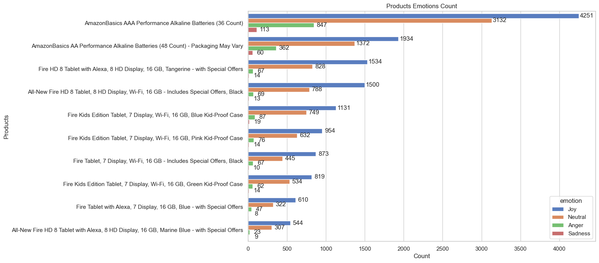

# amazon_products_sentiment_analysis
Sentiment analysis of amazon products and products recommendation

## Project Summary
Our project delves into the intricate world of product reviews, addressing fundamental questions that both consumers and sellers grapple with daily. We embark on a journey to uncover the essence of customer sentiment, probing into the depths of each review to discern its true nature. From quantifying the volume of reviews to deciphering their emotional tone—whether positive, negative, or neutral—we leave no stone unturned. But our pursuit goes beyond mere analysis; we strive to differentiate between genuine feedback and deceptive reviews, employing cutting-edge techniques to detect authenticity. Moreover, we don the hat of a seller, offering insightful suggestions on how to respond to positive or negative feedback to optimize customer satisfaction and drive business growth. Our project is a beacon of insight, illuminating the path to informed decision-making for both consumers and sellers alike. 

## Table of Contents

- [Data Source](#data-source)
- [Data Sets](#data-sets)
- [Data Cleaning](#data-cleaning)
- [Sentiment Analysis](#sentiment-analysis)  
  - [Determining Sentiment](#determining-sentiment)   
  - [Determining Subjectivity](#determining-subjectivity)  
  - [Determining Emotion](#determining-emotion)  
  - [Determining Intensity](#determining-intensity)
  - [Determining Entities Sentiment](#determining-entities-sentiment)  
- [Amazon Products Analysis](#amazon-products-analysis)
  - [Top 10 Reviewed Products](#top-10-reviewed-products)
  - [Highest Rated Products](#highest-rated-products)
  - [Most Recommended Products](#most-recommended-products)
- [Amazon Products Sentiment Analysis](#amazon-products-sentiment-analysis)
  - [Sentiments Data Distribution](#sentiments-data-distribution)
  - [Unlocking Consumer Sentiment: Comprehensive Analysis of Product-Based Sentiment Scores](#unlocking-consumer-sentiment-comprehensive-analysis-of-product-based-sentiment-scores)
    - [Products Sentiments Score](#products-sentiments-score)   
    - [Products Subjectivity Score](#products-subjectivity-score)
    - [Products Emotion Score](#products-emotion-score)    
    - [Products Intensity Score](#products-intensity-score)  
    - [Products Entity Sentiments Score](#products-entity-sentiments-score)  
    - [Products All Sentiments Aggregated Visualization](#products-all-sentiments-aggregated-visualization)
  - [Categories Sentiment Score](#categories-sentiment-score)
- [Temporal Analysis](#temporal-analysis)
  - [Reviewed Products Count](#reviewed-products-count)
  - [Reviewed Products Sentiments Count](#reviewed-products-sentiments-count)
- [Entities Analysis](#entities-analysis)
  - [Entities Count](#entities-count)
  - [Entities Word Cloud](#entities-word-cloud)  
- [Accessing Reviews Authenticity](#accessing-reviews-authenticity)
  - [Moving Average Plots Analysis](#moving-average-plots-analysis)
  - [Heatmaps Analysis](#heatmaps-analysis)
  - [Correlation Analysis](#correlation-analysis)  
- [Statistical Analysis](#statistical-analysis)
  - [Summary Statistics](#summary-statistics)
  - [Histograms](#histograms)
  - [Outliers](#outliers)
  - [Scatter Plot](#scatter-plot)
  - [Hypothesis Testing](#hypothesis-testing)
- [Models Comparison](#models-comparison)
   - [Classification Reports](#classification-reports)
   - [Parameters Heatmaps Comparison](#parameters-heatmaps-comparison)
   - [Models Accuracy Comparison](#models-accuracy-comparison)
- [Products Recommendations Using Machine Learning](#products-recommendations-using-machine-learning)
- [Results and Conclusions](#results-and-conclusions)
- [Dependencies](#dependencies)
- [Future Work](#future-work)
- [Acknowledgments](#acknowledgments)
- [Author](#author)
- [References](#references)

## Data Source
In this project data is obtained from datafinit consumer reviews of amazon products at Kaggle.com 

## Data Sets
in this project source files were renamed as amazon1.csv and amazon2.csv.

## Data Cleaning
Data cleaning was initiated by cleaning date and time columns(dateAdded, dateUpdated, reviews.date, reviews.dateSeen)  which had both values in one column so date and time was splitted into different columns respectively by adding _date and _time at the of main column name for better clarity. After the splitting, null values were determined and mainly three columns (reviews.dateAdded, reviews.id) showed most null values which were deleted. Then missing values of categorical values are filled using clustering predictive method. Details of this method is available in repository [Home Credit Default Risk Categorical Data Cleaning](https://github.com/muhkashiff/Extract_transform_load_EDA_Home_credit) . Cleaned data is then used for performing sentiment analysis.

# Sentiment Analysis  
Sentiment analysis, also known as opinion mining, is a natural language processing (NLP) technique used to determine the sentiment or emotional tone expressed in a piece of text. The goal of sentiment analysis is to automatically identify and extract subjective information, such as opinions, attitudes, emotions, and feelings, from textual data.  

Sentiment analysis can classify text into different categories, such as positive, negative, or neutral, based on the underlying sentiment conveyed by the words and phrases used in the text. It can be applied to various types of textual data, including product reviews, social media posts, customer feedback, news articles, and more. For the sake of project, amazon customer reviews and tested to determine the sentiments.  
In this project reviews were analysed by using below methods to determine type and credibility of the reviews.  
1. Determing Sentiment   
2. Determing Subjectivity  
3. Determing Emotion  
4. Determining Intensity  
5. Determining Sentiment Entity

## Determining Sentiment  
Sentiment score is determined and based on score positive , negative, and neutral label are generated in sentiment_label column.  
Below is code for carrying out sentiment analysis using TextBlob to score the reviews and then bin into three cateogries e.g negative, neutral and positive.
``` bash
# Create a new column 'sentiment' to store the sentiment scores
df_filled_unsupervised['sentiment'] = df_filled_unsupervised['reviews.text'].apply(lambda text: TextBlob(text).sentiment.polarity)

# Convert the continuous sentiment scores to categorical labels (e.g., positive, neutral, negative)
df_filled_unsupervised['sentiment_label'] = pd.cut(df_filled_unsupervised['sentiment'], bins=3, labels=['negative', 'neutral', 'positive'])

# Display the DataFrame with sentiment scores and labels
print(df_filled_unsupervised[['reviews.text', 'sentiment', 'sentiment_label']])
```
## Determining Subjectivity  
In the subjectivity, it is determined if the reviews are subjective or objective. Although for better classification reviews are binned into five categories (Very Objective, Objective, Neutral, Subjective, Very Subjective). Subjectivity score and Label are stored in different columns. code for determining subjectivity is below.  
``` bash
# Function to calculate subjectivity score
def calculate_subjectivity(text):
    blob = TextBlob(text)
    return blob.sentiment.subjectivity

# Apply function to 'reviews.text' column and store results in new column 'subjectivity_score'
sentiment_df['subjectivity_score'] = sentiment_df['reviews.text'].apply(calculate_subjectivity)
# Define bins
bins = [0, 0.2, 0.4, 0.6, 0.8, 1.0]  

# Create labels for bins
labels = ['Very Objective', 'Objective', 'Neutral', 'Subjective', 'Very Subjective']

# Bin the subjectivity scores and create a new column 'binned_subjectivity'
sentiment_df['binned_subjectivity'] = pd.cut(sentiment_df['subjectivity_score'], bins=bins, labels=labels)

# Display DataFrame with new column
print(sentiment_df)  
```
## Determining Emotion  
Emotion is determined and stored into four categories joy, Sadness, Anger, Neutral. below is code snippet.  
``` bash
# Function to perform emotion analysis and categorize into bins
def analyze_emotion(text):
    # Analyze sentiment using TextBlob
    blob = TextBlob(text)
    # Get sentiment polarity
    polarity = blob.sentiment.polarity

    # Categorize into bins based on polarity
    if polarity > 0.3:
        return 'Joy'
    elif polarity < -0.3:
        return 'Sadness'
    elif polarity < 0:
        return 'Anger'
    else:
        return 'Neutral'

# Apply emotion analysis function to 'reviews.text' column and store results in new column 'emotion'
sentiment_df['emotion'] = sentiment_df['reviews.text'].apply(analyze_emotion)

# Display DataFrame with new column
print(sentiment_df)
```
## Determining Intensity  

Intensity is determined using sentiment polarity score and then scores are binned into five categories;  
1. Very Low Intensity
2. Low Intensity
3. Moderate Intensity
4. High Intensity
5. Very high Intensity
``` bash
# Function to perform intensity analysis
def analyze_intensity(text):
    # Analyze sentiment using TextBlob
    blob = TextBlob(text)
    # Get sentiment polarity
    polarity = blob.sentiment.polarity

    # Calculate intensity as the absolute value of polarity
    intensity = abs(polarity)

    return intensity

# Apply intensity analysis function to 'reviews.text' column and store results in new column 'intensity'
sentiment_df['intensity'] = sentiment_df['reviews.text'].apply(analyze_intensity)
# Define bins
bins = [0, 0.2, 0.4, 0.6, 0.8, 1.0]  

# Create labels for bins
labels = ['Very Low Intensity', 'Low Intensity', 'Moderate Intensity', 'High Intensity', 'Very High Intensity']

# Bin the intensity scores and create a new column 'binned_intensity'
sentiment_df['intensity_level'] = pd.cut(sentiment_df['intensity'], bins=bins, labels=labels)

# Display DataFrame with new column
print(sentiment_df)
``` 

##  Determining Entities Sentiment 

Entities sentiment score and key words are determined. For sake of project only keywords with highest score are kept. Since the focus of project is to determine polarity of the reviews.  
``` bash
# Load SpaCy's English language model
nlp = spacy.load("en_core_web_sm")

# Function to perform entity sentiment analysis
def analyze_entity_sentiment(text):
    # Process the text with SpaCy
    doc = nlp(text)

    # Initialize variables to store the entity with the highest sentiment score
    highest_entity = None
    highest_score = float('-inf')  # Initialize with negative infinity

    # Iterate over each named entity in the text
    for ent in doc.ents:
        # Analyze sentiment using TextBlob or any other sentiment analysis tool
        sentiment_score = TextBlob(ent.text).sentiment.polarity
        # Check if the entity and sentiment score are not None
        if ent.text and sentiment_score is not None:
            # Check if the current entity has a higher sentiment score than the previous highest
            if abs(sentiment_score) > highest_score:
                highest_entity = ent.text
                highest_score = abs(sentiment_score)

    # Return the entity with the highest sentiment score
    return highest_entity

# Function to perform binning based on sentiment score
def bin_sentiment(score):
    if score > 0.3:
        return 'Positive'
    elif score < -0.3:
        return 'Negative'
    else:
        return 'Neutral'

# Apply entity sentiment analysis function to each row of the DataFrame
sentiment_df['highest_sentiment_entity'] = sentiment_df['reviews.text'].apply(analyze_entity_sentiment)

# Apply binning to sentiment scores of entities
sentiment_df['entity_sentiment_level'] = sentiment_df['highest_sentiment_entity'].apply(lambda x: bin_sentiment(TextBlob(x).sentiment.polarity) if x else None)

```
## Amazon Products Analysis
In this analysis products that got most reviews and type of reviews are analysed.  

### Top 10 Reviewed Products  
Top 10 reviewed products are below in the table along with number of reviews each product got :
<div align="center">  
  
|Sr|                Name                                | Count |                  
|:-|:--------------------------------------------------:|:-----:|
|1 | AmazonBasics AAA Performance Alkaline Batterie...  | 8343  |
|2 | AmazonBasics AA Performance Alkaline Batteries...  | 3728  |                              
|3 |Fire HD 8 Tablet with Alexa, 8 HD Display, 16 ...   | 2443  |                              
|4 | All-New Fire HD 8 Tablet, 8 HD Display, Wi-Fi,...  | 2370  |                              
|5 | Fire Kids Edition Tablet, 7 Display, Wi-Fi, 16...  | 1986  |                              
|6 | Fire Kids Edition Tablet, 7 Display, Wi-Fi, 16...  | 1676  |                              
|7 | Fire Kids Edition Tablet, 7 Display, Wi-Fi, 16...  | 1429  |                              
|8 | Fire Tablet, 7 Display, Wi-Fi, 16 GB - Include...  | 1395  |                              
|9 | Fire Tablet with Alexa, 7 Display, 16 GB, Blue...  | 987   |                              
|10|  All-New Fire HD 8 Tablet with Alexa, 8 HD Disp... | 883   |                              
</div>  

### Highest Rated Products 

Ratings count visualization shows that most of the products got top ratings of 5 and 4. top 10 highest rated products visualization shows products with most ratings. 

<div align="center">
  <table>
    <tr>
      <td><strong>Ratings Count Visualization</strong></td>
    </tr>
    <tr>
      <td></td>   
    </tr>
  </table>  
</div>  

  

### Most Recommended Products 
Recommendation count visualization shows 31199 products are recommended by customers and 2133 products are not recommended by customers. Recommended products make 93% of total prodcuts reviewed and only 7% products got no recommendation.
<div align="center">
  <table>
    <tr>
      <td><strong>Recommendation Count Visualization</strong></td>
    </tr>
    <tr>
      <td></td>   
    </tr>
  </table>  
</div>  
Amazon products with recommendation are shown below.

  

## Amazon Products Sentiment Analysis 
Sentiment analysis of consumer reviews on Amazon products is conducted through a variety of methods outlined below:

### Sentiments Data Distribution  

This GitHub repository employs sophisticated algorithms to dissect sentiments within Amazon product reviews. The results are elegantly visualized through pie charts, offering a comprehensive overview. A striking revelation surfaces: a staggering 99% of sentiments lean towards positivity or neutrality, while a mere 0.8% veer towards negativity. Yet, the analysis delves deeper, spotlighting the intensity of these sentiments. Notably, 29.2% emanate from extreme intensities, prompting scrutiny for potential falsification. This observation fuels our investigation, augmented by rigorous statistical hypothesis testing.

Further exploration into emotional tones reveals a compelling narrative. An overwhelming 92.9% of reviews exude joy and neutrality, contrasting starkly with a minimal 7.1% expressing anger and sadness, underscoring Amazon's adeptness at evoking positive consumer responses. Subjectivity dominates in 82.6% of reviews, juxtaposed with a more objective 17.4%, delineating a nuanced interplay between personal perspectives and objectivity. This interplay hints at the potential correlation between subjectivity and positive emotions, contrasting with the potential negativity associated with objectivity.

Moreover, entity analysis unveils a notable 97.5% neutrality, with a marginal 2.5% exuding positivity, implying a prevailing authenticity in consumer feedback. In summary, these pie charts serve as a testament not only to the favorable consumer sentiment towards Amazon products but also to the nuanced interplay between subjective experiences and objective assessments, thereby enriching our understanding of consumer perspectives.  


<table>
  <tr>
    <td>Pie Chart Emotion</td>
    <td>Pie Chart Intensity</td>
    <td>Pie Chart Sentiment Entity</td>
  </tr>
  <tr>
    <td></td>
    <td></td>
    <td></td>
  </tr>
  <tr>
    <td>Pie Chart Sentiment</td>
    <td>Pie Chart Subjectivity</td>
  </tr>
  <tr>
    <td></td>
    <td></td>
  </tr>
</table>  

## Unlocking Consumer Sentiment: Comprehensive Analysis of Product-Based Sentiment Scores  

In this exploration, we delve into the intricate world of consumer sentiments surrounding various products. Through meticulous analysis and advanced algorithms, we unravel the layers of emotions and opinions expressed by consumers in their reviews. Our goal is to provide a deep understanding of how products resonate with consumers, from eliciting joy and satisfaction to addressing concerns and disappointments. Join us as we navigate through the rich tapestry of sentiments, offering valuable insights into consumer perceptions and preferences.

### Products Sentiments Score  


###  Products Subjectivity Score     
  

### Products Emotion Score 

 
### Products Intensity Score  

 

### Products Entity Sentiments Score

  

### Products All Sentiments Aggregated Visualization

  

### Categories Sentiment Score  
  

## Temporal Analysis
Temporal analysis offers a unique lens to delve into evolving trends and preferences over time. Our investigation focuses on identifying the top 10 products based on consumer reviews within a specified time frame, concurrently mapping sentiment counts to discern prevailing attitudes. By leveraging temporal analysis, we aim to unearth not only the most sought-after products but also the sentiments surrounding them, providing actionable insights for businesses and researchers alike.

Through rigorous data mining and analysis, we navigate through the temporal landscape, unraveling the temporal evolution of consumer preferences. This journey enables us to decode the pulse of the market, pinpointing the products that have captured consumers' attention and elicited significant feedback. Additionally, by quantifying sentiment counts across this temporal spectrum, we gain a nuanced understanding of the prevailing attitudes towards these products.

As we embark on this temporal analysis, we anticipate uncovering dynamic shifts, seasonal trends, and emerging patterns that shape consumer sentiment. By synthesizing these insights, we aim to empower stakeholders to make informed decisions, capitalize on market opportunities, and tailor strategies to resonate with consumer preferences over time. 

### Reviewed Products Count
  

### Reviewed Products Sentiments Count  
  

## Entities Analysis  
In the realm of consumer insights, entity analysis unveils a fascinating narrative, shedding light on the most prominent entities within Amazon product reviews. Our exploration focuses on the top 10 entities identified through meticulous analysis, offering a glimpse into the words that dominate consumer discourse. As we delve into this analysis, we encounter a diverse array of entities, ranging from brand names like Amazon and Alexa to seasonal references like Christmas. Each entity is accompanied by its sentiment level, providing a nuanced understanding of consumer attitudes and perceptions. Through quantitative analysis, we discern the frequency with which these entities appear in reviews, illuminating their significance in shaping consumer experiences. Accompanied by a visually captivating word cloud image, our exploration aims to unravel the intricate web of consumer sentiments and preferences surrounding Amazon products, offering valuable insights for businesses and researchers alike.  

### Entities Count
Below is key word frequency (count). 

| Sr# | Highest Score Entity | Entity Sentiment Level | Count |
|:---:|:--------------------:|:----------------------:|:-----:|
| 1   | Amazon               | Neutral                | 1242  |
| 2   | first                | Neutral                | 646   |
| 3   | Christmas            | Neutral                | 558   |
| 4   | Alexa                | Neutral                | 365   |
| 5   | Kindle               | Neutral                | 284   |
| 6   | iPad                 | Neutral                | 275   |
| 7   | Duracell             | Neutral                | 270   |
| 8   | two                  | Neutral                | 265   |
| 9   | 2                    | Neutral                | 255   |
| 10  | Love                 | Positive               | 218   |


### Entities Word Cloud
Word Cloud image show entities used in the reviews. The bigger the size of word more frequent it is used.  


## Accessing Reviews Authenticity
In the realm of consumer feedback analysis, ensuring the authenticity of reviews is paramount for businesses and consumers alike. Our exploration delves into innovative methodologies, leveraging moving average charts, heat maps, and correlation analyses to assess the authenticity of reviews for both recommended and rated products. By employing moving average charts, we track the trends and fluctuations in review scores over time, providing insights into the consistency and reliability of consumer sentiments. Heat maps offer a visual representation of the relationships between various product attributes and review ratings, unveiling patterns and correlations that may indicate genuine consumer experiences. Furthermore, correlation analyses allow us to identify the degree of association between recommended products and their corresponding ratings, shedding light on the alignment between consumer preferences and product performance for both recommended and rated items. Through these analytical techniques, we aim to provide stakeholders with robust tools for evaluating the credibility and trustworthiness of consumer reviews, ultimately fostering transparency and informed decision-making in the marketplace.   

## Moving Average Plots Analysis 

### Moving Average Plot of Sentiments Vs Recommendation
<table>
  <tr>
    <td>Recommendations Vs Emotion</td>
    <td>Recommendations Vs Subjectivity</td>
  </tr>
  <tr>
    <td></td>
    <td></td>
    
  </tr>
  <tr>
    <td>Recommendations Vs Sentiment</td>
    <td>Recommendations Vs Intensity</td>
  </tr>
  <tr>
    <td></td>
    <td></td>
  </tr>
</table>  

### Moving Average Plot of Sentiments Vs Rating
<table>
  <tr>
    <td>Rating Vs Emotion</td>
    <td>Rating Vs Subjectivity</td>
  </tr>
  <tr>
    <td></td>
    <td></td>
    
  </tr>
  <tr>
    <td>Rating Vs Sentiment</td>
    <td>Rating Vs Intensity</td>
  </tr>
  <tr>
    <td></td>
    <td></td>
  </tr>
</table> 

## Heatmaps Analysis

### Ratings Vs Sentiment features Heatmaps
<table>
  <tr>
    <td>Rating Vs Emotion</td>
    <td>Rating Vs Subjectivity</td>
  </tr>
  <tr>
    <td></td>
    <td></td>
    
  </tr>
  <tr>
    <td>Rating Vs Sentiment</td>
    <td>Rating Vs Intensity</td>
  </tr>
  <tr>
    <td></td>
    <td></td>
  </tr>
</table>  

### Recommendation Vs Sentiment features Heatmaps
<table>
  <tr>
    <td>Recommendations Vs Emotion</td>
    <td>Recommendations Vs Subjectivity</td>
  </tr>
  <tr>
    <td></td>
    <td></td>
    
  </tr>
  <tr>
    <td>Recommendations Vs Sentiment</td>
    <td>Recommendations Vs Intensity</td>
  </tr>
  <tr>
    <td></td>
    <td></td>
  </tr>
</table>  

## Correlation Analysis  

<table>
  <tr>
    <td>Correlation Sentiment Vs Intensity</td>
    <td>Correlation Sentiment Vs Subjectivity</td>
    <td>Correlation Subjectivity Vs Intensity</td>
  </tr>
  <tr>
    <td></td>
    <td></td>
    <td></td>
  </tr>
</table>


## Statistical Analysis  

### Summary Statistics
<div align="center">  
  
| Feature            | Sentiments (Results)  | Subjectivity (Results)|Emotion (Results)| Intensity (Results)|
| :----------------- | :--------------------:| :--------------------:|:---------------:|:------------------:|
|        count       |   33332.000000        |33332.000000           |33332.000000     |33332.000000        |
|         mean       |   0.364646            |0.543263               |0.364646         |0.386365            |
|         std        |   0.297416            | 0.231981              |0.297416         |0.268597            |    
|        min         |  -1.000000            |0.000000               |-1.000000        |0.000000            |
|       25%          |   0.150000            |  0.422222             |0.150000         |0.170833            |
|        50%         |   0.350000            |0.568750               |0.350000         |0.359175            |
|        75%         |   0.562500            |0.700000               |0.562500         |0.565395            |
|         max        |   1.000000            |1.000000               |1.000000         |1.000000            |

</div>  

### Histograms
<table>
  <tr>
    <td>Sentiments Histogram</td>
    <td>Intensity Histogram</td>
  </tr>
  <tr>
    <td></td>
    <td></td>
  </tr>
   <tr>
    <td>Emotion Histogram</td>
    <td>Subjectivity Histogram</td>
  </tr>
  <tr>
    <td></td>
    <td></td>
  </tr>
</table>  


### Scatter Plot


### Outliers 
<table>
  <tr>
    <td>Sentiments Score Outliers</td>
    <td>Intensity Score Outliers</td>
  </tr>
  <tr>
    <td></td>
    <td></td>
  </tr>
   <tr>
    <td>Emotion Score Outliers</td>
    <td>Subjectivity Score Outliers</td>
  </tr>
  <tr>
    <td></td>
    <td></td>
  </tr>
</table>  

### Hypothesis Testing  
```bash
# Download the VADER lexicon
nltk.download('vader_lexicon')

# Step 1: Read Data
data = sentiment_df['reviews.text']

# Step 2: Labeling Data
sid = SentimentIntensityAnalyzer()
authenticity_labels = []

for review in data:
    # Perform sentiment analysis to determine the sentiment intensity
    sentiment_scores = sid.polarity_scores(review)
    
    # Classify reviews based on sentiment intensity thresholds
    if sentiment_scores['compound'] > 0.9:  # Very high positive sentiment intensity
        authenticity_labels.append('fake')
    elif sentiment_scores['compound'] < 0:  # Very low or negative sentiment intensity
        authenticity_labels.append('fake')
    else:
        authenticity_labels.append('genuine')

# Add authenticity labels to the DataFrame
sentiment_df['authenticity_label'] = authenticity_labels 

# Step 3: Hypothesis Testing
# Count the number of genuine and fake reviews
genuine_count = (sentiment_df['authenticity_label'] == 'genuine').sum()
fake_count = (sentiment_df['authenticity_label'] == 'fake').sum()

# Create a contingency table
contingency_table = [[genuine_count, fake_count],
                     [len(sentiment_df) - genuine_count, len(sentiment_df) - fake_count]]

# Perform Fisher's exact test
oddsratio, p_value = fisher_exact(contingency_table)

# Set the significance level
alpha = 0.05

# Print the results of the hypothesis test
if p_value < alpha:
    print("Reject the null hypothesis. There is a significant difference in the proportion of genuine and fake reviews.")
else:
    print("Fail to reject the null hypothesis. There is no significant difference in the proportion of genuine and fake reviews.")
```

Output of hypyothesis testing  

```
Reject the null hypothesis. There is a significant difference in the proportion of genuine and fake reviews.
```


## Products Recommendations Using Machine Learning

``` bash
user_review = "I absolutely not loved this product!"
recommended_items = recommend_items(user_review)
print("Recommended Items:")
for item in recommended_items:
    print(item)
```
Recommended products of negative review  

```
Recommended Items:
All-New Fire HD 8 Tablet, 8 HD Display, Wi-Fi, 16 GB - Includes Special Offers, Black
AmazonBasics AAA Performance Alkaline Batteries (36 Count)
All-New Fire HD 8 Tablet, 8" HD Display, Wi-Fi, 16 GB - Includes Special Offers, Magenta
AmazonBasics AAA Performance Alkaline Batteries (36 Count)
Fire Tablet, 7 Display, Wi-Fi, 16 GB - Includes Special Offers, Black
```
Recommended items of postive review  
``` bash
user_review = "I absolutely loved this product!"
recommended_items = recommend_items(user_review)
print("Recommended Items:")
for item in recommended_items:
    print(item)
```

```
Recommended Items:
Fire Tablet, 7 Display, Wi-Fi, 16 GB - Includes Special Offers, Black
Expanding Accordion File Folder Plastic Portable Document Organizer Letter Size
AmazonBasics AA Performance Alkaline Batteries (48 Count) - Packaging May Vary
Brand New Amazon Kindle Fire 16gb 7" Ips Display Tablet Wifi 16 Gb Blue
AmazonBasics AAA Performance Alkaline Batteries (36 Count)

```
## Models Comparison  

### Classification Reports

#### Naive Bayes Classification Reports  
<table>
  <tr>
    <td>Tfidf Vectoriztaion Naive Bayes</td>
    <td>Count Vectorization Naive Bayes</td>
  </tr>
  <tr>
    <td></td>
    <td></td>    
  </tr>
</table>  

#### Gradient Boost Classification Reports  
<table>
  <tr>
    <td>Tfidf Vectoriztaion Gradient Boost</td>
    <td>Count Vectorization Gradient Boost</td>
  </tr>
  <tr>
    <td></td>
    <td></td>    
  </tr>
</table>  

#### Random Forest Classification Reports  
<table>
  <tr>
    <td>Tfidf Vectoriztaion Random Forest</td>
    <td>Count Vectorization Random Forest</td>
  </tr>
  <tr>
    <td></td>
    <td></td>    
  </tr>
</table>  

#### SVM Classification Reports  
<table>
  <tr>
    <td>Tfidf Vectoriztaion SVM</td>
    <td>Count Vectorization SVM</td>
  </tr>
  <tr>
    <td></td>
    <td></td>    
  </tr>
</table>  

#### Logistic Regression Classification Reports  
<table>
  <tr>
    <td>Tfidf Vectoriztaion Logistic Regression</td>
    <td>Count Vectorization Logistic Regression</td>
  </tr>
  <tr>
    <td></td>
    <td></td>    
  </tr>
</table> 

## Parameters Heatmaps Comparison

#### Models Precision Comparison
<table>
  <tr>
    <td>Tfidf Vectoriztaion Precision</td>
    <td>Count Vectorization Precision</td>
  </tr>
  <tr>
    <td></td>
    <td></td>    
  </tr>
</table>  

#### Models F1 Score Comparison
<table>
  <tr>
    <td>Tfidf Vectoriztaion F1 Score</td>
    <td>Count Vectorization F1 Score</td>
  </tr>
  <tr>
    <td></td>
    <td></td>    
  </tr>
</table>  

#### Models Recall Score Comparison
<table>
  <tr>
    <td>Tfidf Vectoriztaion Recall Score</td>
    <td>Count Vectorization Recall Score</td>
  </tr>
  <tr>
    <td></td>
    <td></td>    
  </tr>
</table>


### Models Accuracy Comparison


## Results and Conclusions

  
## Dependencies

This project involves using various dependences listed below for data cleaning and predictions.

```bash
# import Denpendencies
# import Denpendencies
import numpy as np
import pandas as pd
import os
import matplotlib.pyplot as plt
import seaborn as sns
import time
from sklearn.cluster import KMeans
from sklearn.decomposition import PCA
from sklearn.preprocessing import StandardScaler
from datetime import datetime
from textblob import TextBlob
from sklearn.feature_extraction.text import CountVectorizer
from sklearn.model_selection import train_test_split
from sklearn.naive_bayes import MultinomialNB
from sklearn.metrics import accuracy_score
from sklearn.linear_model import LogisticRegression
from sklearn.svm import SVC
from sklearn.ensemble import RandomForestClassifier, GradientBoostingClassifier
from sklearn.metrics import accuracy_score, classification_report
from sklearn.feature_extraction.text import TfidfVectorizer
import nltk
import spacy
from sklearn.linear_model import LinearRegression 
from wordcloud import WordCloud 
from nltk.sentiment.vader import SentimentIntensityAnalyzer
from scipy.stats import fisher_exact
from scipy.stats import norm
from nltk.tokenize import word_tokenize
from nltk.corpus import stopwords
from nltk.collocations import BigramCollocationFinder
from nltk.metrics import BigramAssocMeasures
```
## Future Work


## Acknowledgments


## Author

Muhammad Kashif 

## References
[1] [Amazon Products data](https://www.kaggle.com/datasets/datafiniti/consumer-reviews-of-amazon-products?resource=download)
